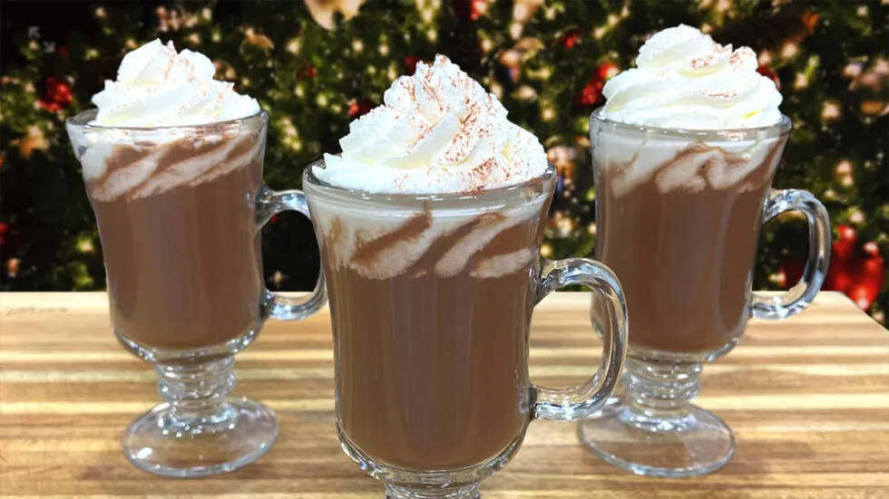

# :coffee: Hot Chocolate

{ loading=lazy }

| :timer_clock: Total Time |
|:-----------------------: |
| 10 minutes |

## :salt: Ingredients

- :glass_of_milk: 170 g whole milk
- :glass_of_milk: 57 g heavy cream
- :chocolate_bar: 1 Tbsp (5 g) unsweetened cocoa powder
- :chestnut: 57 g 70 percent chocolate
- :candy: 2 Tbsp (25 g) granulated sugar
- :salt: 1 pinch salt
- :flower_playing_cards: 2 tsp vanilla
- :chestnut: 1 Tbsp (7 g) cornstarch
- :candy: 1 small pinch cinnamon
- 2 Tbsp Baileys or Kahlua

## :cooking: Cookware

- 1 sauce pan

## :pencil: Instructions

### Step 1

In a sauce pan, heat the whole milk and the heavy cream in a sauce pan.

### Step 2

At medium to low heat, add the unsweetened cocoa powder mix in well, add the 70 percent chocolate, granulated sugar,
salt, vanilla and bring a boil.

### Step 3

Add the cornstarch, cinnamon and Baileys or Kahlua mix well and turn off the heat immediately.

## :link: Source

- <https://chefjeanpierre.com/recipes/drinks/hot-chocolate/>
