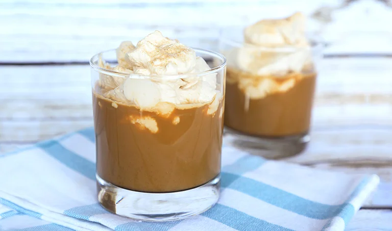

# :coffee: Iced Chai Latte

{ loading=lazy }

| :fork_and_knife_with_plate: Serves | :timer_clock: Total Time |
|:----------------------------------:|:-----------------------: |
| 2 | 4 minutes |

## :salt: Ingredients

=== "Whipped Cream"

    - :glass_of_milk: 0.5 cup (114 g) heavy cream
    - :bread: 2 tsp (5 g) TJ's Spicy Chai Tea Latte Mix
    - :flower_playing_cards: 1 tsp Bourbon Vanilla Extract

=== "Chai Iced Latte"

    - :bread: 6 Tbsp (41 g) TJ's Spicy Chai Tea Latte Mix
    - :droplet: 0.5 cup (114 g) hot water
    - :apple: 1 cup (280 g) TJ's Cold Brew Coffee Concentrate

## :cooking: Cookware

- :bowl_with_spoon: 1 large bowl
- :gear: 1 hand mixer or stand mixer
- 1 medium-sized pitcher

## :pencil: Instructions - Whipped Cream

### Step 1

In a large bowl, with a hand mixer or stand mixer combine: 1/2 cup heavy cream, 2 teaspoons TJ's Spicy Chai Tea Latte
Mix and 1 teaspoon Bourbon Vanilla Extract. Whip until stiff peaks form, about 4 minutes. Set aside.

## :pencil: Instructions - Chai Iced Latte

### Step 2

In a medium-sized pitcher, whisk together 6 tablespoons TJ's Spicy Chai Tea Latte Mix and 1/2 cup hot water until mix
completely dissolves. Add 1 cup TJ's Cold Brew Coffee Concentrate to pitcher and stir until combined. Serve chilled or
pour over ice (we recommend making your own cold brew ice cubes), then top with reserved whipped cream.

## :link: Source

- <https://www.traderjoes.com/home/recipes/iced-chai-latte>
