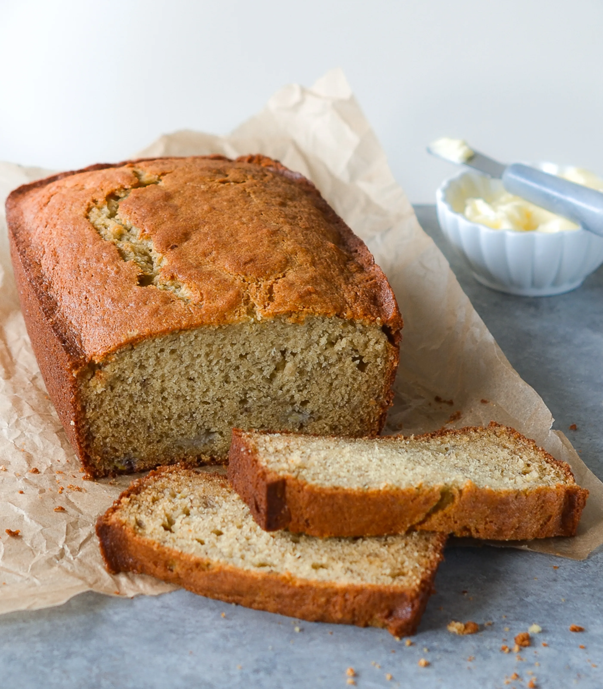

# :banana: Best-Ever Banana Bread

{ loading=lazy }

| :timer_clock: Total Time |
|:-----------------------: |
| 60 minutes |

## :salt: Ingredients

=== "Bread"

    - :candy: 1.25 cups (248 g) granulated sugar
    - :butter: 0.5 cup (113 g) unsalted butter
    - :egg: 2 eggs
    - :bacon: 1.5 cups (3-4) banana
    - 0.5 cup [buttermilk][1]
    - :flower_playing_cards: 1 tsp vanilla
    - :bread: 2.5 cups (300 g) all-purpose flour
    - :chestnut: 1 tsp baking soda
    - :salt: 1 tsp salt
    - :leafy_green: 1 cup (114 g) nuts (optional)

=== "Streusel"

    - :bread: 0.5 cup (60 g) all-purpose flour
    - :salt: 0.25 tsp salt
    - :glass_of_milk: 4 Tbsp (68 g) melted butter
    - :maple_leaf: 0.5 cup (106 g) brown sugar
    - :chestnut: 1 tsp (4 g) cinnamon

## :cooking: Cookware

- 1 8" loaf pan

## :pencil: Instructions

### Step 1

Combine granulated sugar, softened butter, eggs, banana (3-4), [buttermilk](../ingredients/buttermilk.md),
vanilla, all-purpose flour, baking soda, salt, and nuts (optional).

### Step 2

Make the streusel topping by whisking together the brown sugar, salt, all-purpose flour, and cinnamon. Add
the melted butter, stirring until well combined. Add the topping to the pan.

!!! note

    The crust makes it sweet enough as it is. Streusel topping is not required.

### Step 3

Heat oven to 350°F.

### Step 4

Bake in 8" loaf pan for 1 hour.

## :link: Source

- Recipe Box

[1]: <../ingredients/buttermilk.md>
