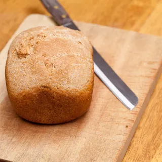

# :bread: Bread Machine French Bread

{ loading=lazy }

| :timer_clock: Total Time |
|:-----------------------: |
| 4.50 hours |

## :salt: Ingredients

=== "White"

    - :bread: 4 cups (480 g) bread flour

=== "20% Whole Wheat"

    - :bread: 384 g bread flour
    - :bread: 98 g whole wheat flour

- :droplet: 1.33 cups (302 g) warm water
- :olive: 1.5 Tbsp (19 g) olive oil
- :salt: 1 Tbsp salt
- :candy: 2 Tbsp (20 g) sugar
- :tea: 2.25 tsp (7 g) yeast

## :cooking: Cookware

- 1 bread pan
- 1 bread machine

## :pencil: Instructions

### Step 1

Place warm water into the bread pan of the bread machine.

### Step 2

Add the following in order: olive oil, salt, and sugar.

### Step 3

Add bread flour, covering the liquid. Make a small indentation at the top center of the flour, but not deep enough to reach
the liquid.

### Step 4

Add the yeast to this indentation.

### Step 5

Close bread machine and press "start". Take 4.5 hours.
