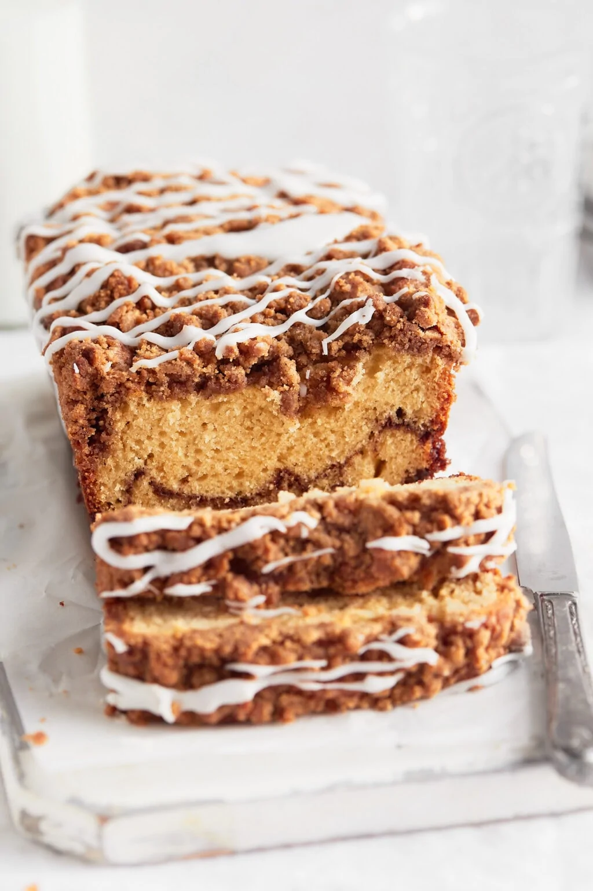

# :bread: Cinnamon Streusel Bread

{ loading=lazy }

| :fork_and_knife_with_plate: Serves | :timer_clock: Total Time |
|:----------------------------------:|:-----------------------: |
| 16 | 1 hour |

## :salt: Ingredients

=== "Cinnamon Sugar Swirl"

    - :maple_leaf: 0.5 cup (106 g) brown sugar
    - :chestnut: 2 tsp (6 g) ground cinnamon
    - :salt: 1 pinch salt

=== "Bread"

    - :butter: 0.75 cup butter
    - :candy: 0.33 cup (65 g) granulated sugar
    - :candy: 0.33 cup (70 g) light brown sugar
    - :egg: 2 large eggs
    - :flower_playing_cards: 1 Tbsp vanilla
    - :bread: 2.25 cups (270 g) all-purpose flour
    - :chestnut: 2 tsp baking powder
    - :chestnut: 0.5 tsp baking soda
    - :chestnut: 1 tsp (4 g) cinnamon
    - :salt: 1 tsp salt
    - 1 cup [buttermilk][1]

=== "Cinnamon Streusel Topping"

    - :bread: 0.75 cup (90 g) all-purpose flour
    - :maple_leaf: 0.33 cup (70 g) brown sugar
    - :chestnut: 2 tsp (8 g) cinnamon
    - :salt: some salt
    - :butter: 6 Tbsp butter

=== "Vanilla Glaze"

    - :candy: 1 cup (200 g) powdered sugar
    - :flower_playing_cards: 0.5 tsp vanilla
    - :glass_of_milk: 1 Tbsp (17 g) butter, melted
    - :glass_of_milk: 1 Tbsp (14 g) milk or cream
    - :salt: 1 pinch salt

## :cooking: Cookware

- 1 1 pound loaf pan
- :page_facing_up: 1 parchment paper
- :bowl_with_spoon: 1 small bowl
- :gear: 1 stand mixer
- :spoon: 1 rubber spatula
- 1 butter knife
- :wastebasket: 1 wire rack
- :bowl_with_spoon: 1 small bowl

## :pencil: Instructions

### Step 1

Preheat the oven to 350°F and line a 1 pound loaf pan with parchment paper on all sides. Set aside.

## :pencil: Instructions - Cinnamon Sugar Swirl

### Step 2

In a small bowl, combine 1/2 cup brown sugar, 2 teaspoons ground cinnamon, and a pinch of salt to make the cinnamon
sugar swirl. Mix together and set aside.

## :pencil: Instructions - Bread

### Step 3

In a stand mixer fit with the whisk attachment, cream the butter, granulated sugar and light brown sugar together until
light and fluffy, about 2 minutes.

### Step 4

Scrape down the sides of the bowl and add the eggs and vanilla extract, beating until smooth and well combined.

### Step 5

In a separate bowl combine the all-purpose flour, baking powder, baking soda, cinnamon, and salt. Stir to evenly
distributed everything.

### Step 6

Add about half of the dry ingredients and mix. Next, add the [buttermilk](../ingredients/buttermilk.md) and mix. Add the remaining dry ingredients and
mix until no streaks of flour remain. Do not over mix.

### Step 7

Spoon half the batter into your prepared pan and use a greased rubber spatula to spread the batter to the edges. Top
with the cinnamon sugar mixture. Spoon the remaining batter over the sugar and spread to the edges of the pan.

### Step 8

Use a butter knife to make big swirls in your bread, dragging your knife through the bread a few times.

## :pencil: Instructions - Cinnamon Streusel Topping

### Step 9

Make the streusel topping (I usually just do this in the dirty bowl you made the batter in because I am lazy, but you
can also use a clean bowl). Combine the all-purpose flour, brown sugar, cinnamon, and salt and stir to combine. Add the
melted butter and mix until the mixture resembles wet sand and clumps together.

### Step 10

Sprinkle the streusel evenly over the top of your bread.

### Step 11

Bake for 45 minutes or until a knife inserted into he middle comes out mostly clean and the bread is golden brown.
Transfer to a wire rack to cool.

## :pencil: Instructions - Vanilla Glaze

### Step 12

While the bread cools, make the vanilla glaze. Combine 1 cup powdered sugar, 1/2 teaspoon vanilla extract, 1 tablespoon
butter, melted, 1 tablespoon milk or cream, pinch of salt to make the glaze in a small bowl and whisk together until
smooth and creamy.

### Step 13

Once the bread is cool, drizzle with the glaze and enjoy!

## :link: Source

- <https://bromabakery.com/cinnamon-streusel-bread/>

[1]: <../ingredients/buttermilk.md>
