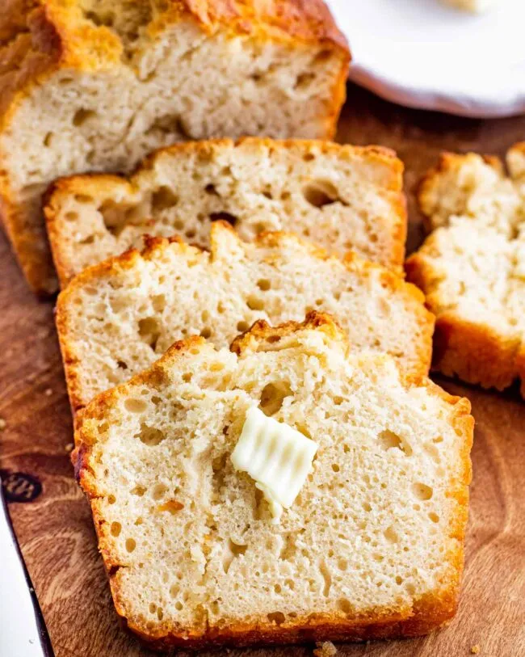

# :bread: Honey Beer Bread

{ loading=lazy }

| :timer_clock: Total Time |
|:-----------------------: |
| 60 minutes |

## :salt: Ingredients

- :bread: 3 cups (276 g) flour
- :candy: 2 Tbsp (20 g) sugar
- :chestnut: 1 Tbsp baking powder
- :salt: 1 tsp salt
- :glass_of_milk: 1 12-oz bottle beer
- :honey_pot: 2 Tbsp honey
- :butter: 4 Tbsp butter

## :cooking: Cookware

- 1 loaf pan
- 1 pan
- 1 Spoon

## :pencil: Instructions

### Step 1

Preheat oven to 350°F.

### Step 2

Grease loaf pan.

### Step 3

Whisk together flour, sugar, baking powder, and salt. Stir in beer and melted honey.

### Step 4

Pour half melted butter into pan. Spoon in batter and pour rest of butter on top.

### Step 5

Bake 50 to 60 minutes.
