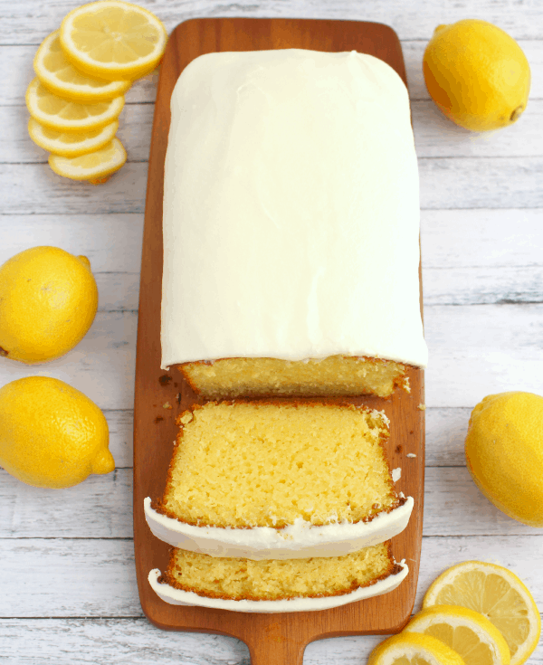

# :lemon: Lemon Bread

{ loading=lazy }

| :fork_and_knife_with_plate: Serves | :timer_clock: Total Time |
|:----------------------------------:|:-----------------------: |
| 10 | 1.08 hours |

## :salt: Ingredients

=== "Bread"

    - :bread: 1.5 cups (180 g) all-purpose flour
    - :candy: 3.4 oz (47 g) instant lemon pudding mix
    - :chestnut: 1.2 tsp baking powder
    - :chestnut: 0.5 tsp baking soda
    - :salt: 0.5 tsp salt
    - :egg: 3 eggs
    - :candy: 1 cup (198 g) granulated sugar
    - :butter: 2 Tbsp (28 g) unsalted butter
    - :flower_playing_cards: 1 tsp vanilla
    - :flower_playing_cards: 2 tsp (8 g) lemon extract
    - :tangerine: 0.33 cup (74 g) lemon juice
    - :olive: 0.5 cup (99 g) vegetable oil
    - :glass_of_milk: 0.75 cup (170 g) plain Greek yogurt
    - :tangerine: 1 lemon

=== "Frosting"

    - :butter: 3 Tbsp butter
    - :tangerine: 3 Tbsp (42 g) lemon juice
    - :flower_playing_cards: 1 tsp (4 g) lemon extract
    - :candy: 1.5 cups (170 g) confectioners' sugar

## :cooking: Cookware

- 1 5 x 9 loaf pan
- :page_facing_up: 1 parchment paper
- :bowl_with_spoon: 1 mixing bowl
- 1 stand or hand mixer
- 1 cooling rack
- :gear: 1 hand or stand mixer

## :pencil: Instructions - Bread

### Step 1

Preheat oven to 350°F. Line the bottom of a 5 x 9 loaf pan with a piece of parchment paper. (With a pencil, trace the
bottom of the pan on a piece of parchment paper and cut out with scissors.) Spray the pan, and parchment paper with
non-stick baking spray. Set aside.

### Step 2

In a mixing bowl, combine the all-purpose flour, instant lemon pudding mix, baking powder, baking soda, and salt. With a
stand or hand mixer, combine the eggs, granulated sugar, softened unsalted butter, vanilla, lemon extract, lemon juice,
vegetable oil and plain Greek yogurt. Mix until evenly combined. Gradually add the dry ingredients to the wet, stopping
to scrape down the sides of the bowl. Add the lemon zest, and mix until just combined. Pour the batter into the prepared
loaf pan. Bake for 55 minutes, or until center is fully set, and a toothpick inserted comes out crumb free.

### Step 3

After baking, let cool in the pan for 5 to 10 minutes. Run a knife around the sides of the pan, invert and remove from
the pan, removing the parchment paper from the bottom. Cool completely on a cooling rack.

## :pencil: Instructions - Frosting

### Step 4

Combine the butter, lemon juice and lemon extract with hand or stand mixer. Gradually add the
confectioners' sugar, and beat until smooth and creamy. Evenly spread the frosting over the top of the loaf. Refrigerate
to let frosting set completely before slicing. Refrigerate any leftovers in an airtight container.

## :link: Sources

- <https://lilluna.com/better-than-starbucks-lemon-loaf>
- <https://www.thepancakeprincess.com/2022/05/25/best-lemon-loaf-bake-off/>
