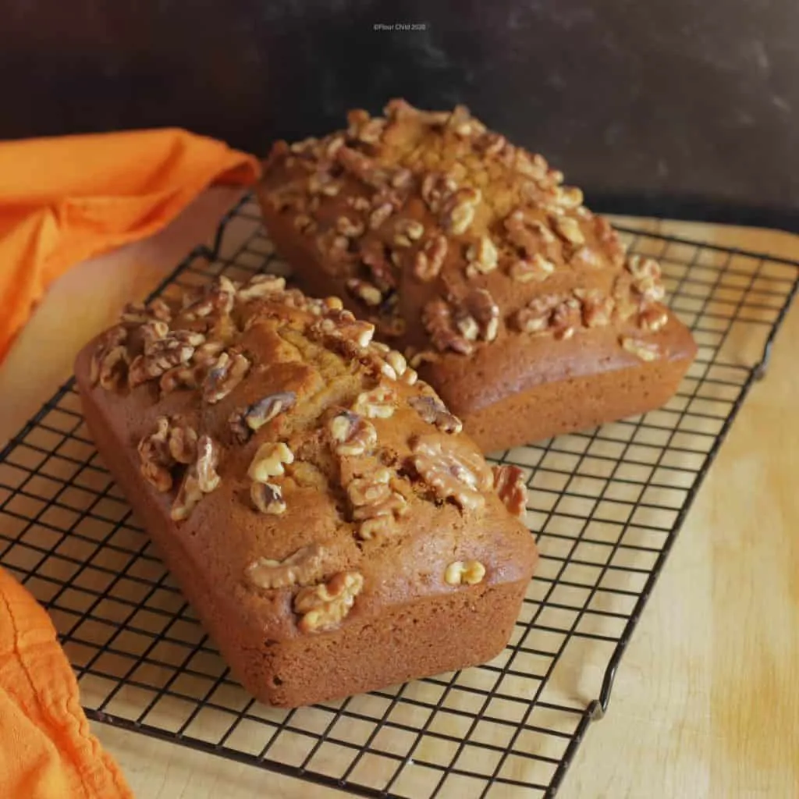

# :bread: Monastery Pumpkin Bread

{ loading=lazy }

| :timer_clock: Total Time |
|:-----------------------: |
| 1.5 hours |

## :salt: Ingredients

=== "Full Batch"

    - :bread: 3.5 cups (322 g) flour
    - :candy: 3 cups (468 g) sugar
    - :chestnut: 2 tsp baking soda
    - :chestnut: 1 tsp (4 g) cinnamon
    - :apple: 1 tsp nutmeg
    - :salt: 1.5 tsp salt
    - :egg: 4 eggs
    - :olive: 1 cup (200 g) oil
    - :droplet: 0.67 cup (152 g) water
    - :melon: 2 cups (454 g) pumpkin
    - some walnut halves

=== "Half Batch"

    - :bread: 1.75 cups (161 g) flour
    - :candy: 1.5 cups (234 g) sugar
    - :chestnut: 1 tsp baking soda
    - :chestnut: 0.5 tsp (2 g) (1.5 g) cinnamon
    - :apple: 0.5 tsp nutmeg
    - :salt: 0.75 tsp (4.5 g) salt
    - :egg: 2 eggs
    - :olive: 0.5 cup (100 g) oil
    - :droplet: 0.33 cup (75 g) water
    - :melon: 1 cup (227 g) pumpkin
    - some walnut halves

## :cooking: Cookware

- :cookie: 1 loaf pans

## :pencil: Instructions

### Step 1

Preheat oven to 350°F.

### Step 2

Sift together flour, sugar, baking soda, cinnamon, nutmeg, and salt.

### Step 3

Combine eggs, oil, water, and pumpkin and mix well.

### Step 4

Stir into dry ingredients and mix in walnut halves.

### Step 5

Pour into three greased loaf pans.

### Step 6

Bake for 1 hour and cool before slicing.

## :link: Source

- Recipe Box
