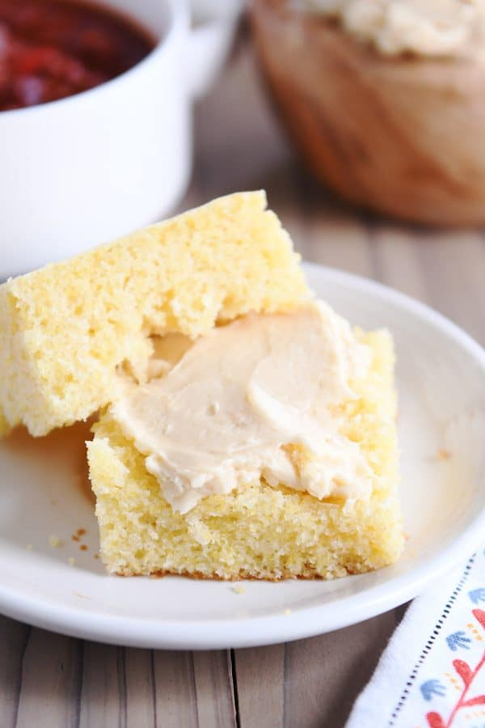

# :corn: The Best Cornbread

| :timer_clock: Total Time |
|:-----------------------: |
| 35 minutes |

## :salt: Ingredients - Cornbread

- :corn: 0.5 cup (69 g) cornmeal
- :ear_of_rice: 1.5 cup (180 g) all-purpose flour
- :candy: 0.67 cup (132 g) granulated sugar
- :dash: 1 Tbsp baking powder
- :salt: 0.5 tsp salt
- :oil_drum: 0.33 cup (66 g) vegetable oil
- :butter: 3 Tbsp (42 g) butter, melted
- :egg: 2 large eggs, beaten
- :glass_of_milk: 1.25 cup (284 g) milk

## :salt: Ingredients - Honey Butter

- :honey_pot: 0.5 cup honey
- :butter: 1 cup unsalted butter
- :dango: 0.5 cup marshmallow fluff

## :cooking: Cookware

- 1 large bowl
- 1 rubber spatula
- 1 electric mixer

## :pencil: Instructions

### Step 1

Preheat the oven to 350°F. Lightly grease an 8 x 8 or 9 x 9 inch baking pan (I always use metal; glass pans will bake
differently).

### Step 2

For the cornbread, in a large bowl, whisk together the cornmeal, all-purpose flour, granulated sugar, baking powder, and
salt. Add the oil, butter, melted, eggs, beaten, and milk and stir with a whisk or rubber spatula until just combined.
The batter will be runny.

### Step 3

Spread the batter evenly in the prepared pan. Bake for 30 to 35 minutes until a toothpick inserted in the center comes
out clean or with a few moist crumbs.

### Step 4

For the honey butter, whip the honey, unsalted butter, and marshmallow fluff together with an electric mixer. Best
served at room temperature so it is soft and spreadable.

## :link: Sources

- <https://www.melskitchencafe.com/the-cornbread-and-fluffy-honey-butter/>
- <https://www.thepancakeprincess.com/2019/11/24/best-sweet-cornbread-bake-off/>
