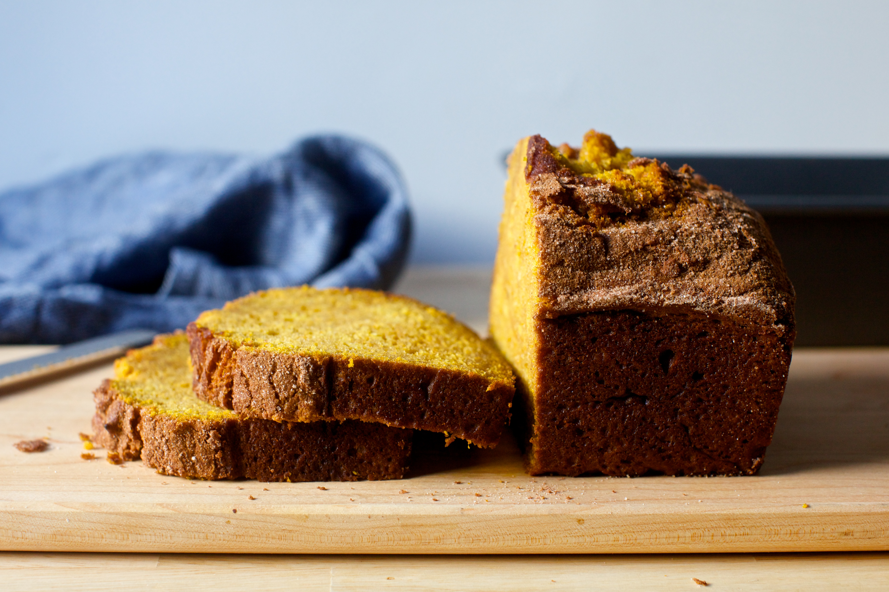

# :jack_o_lantern: The Best Pumpkin Bread

{ loading=lazy }

| :timer_clock: Total Time |
|:-----------------------: |
| 1.42 hours |

## :salt: Ingredients - Bread

- :jack_o_lantern: 1 15-oz can pumpkin puree
- :oil_drum: 0.5 cup vegetable oil
- :egg: 3 large eggs
- :candy: 330 g granulated sugar
- :dash: 1.5 tsp baking powder
- :cup_with_straw: 0.75 tsp baking soda
- :salt: 0.75 tsp salt
- :custard:  0.75 tsp cinnamon
- :chestnut: 0.25 heaped tsp nutmeg
- :sweet_potato: 0.25 heaped tsp ginger
- :four_leaf_clover: 2 pinches ground cloves
- :ear_of_rice: 295 g all-purpose flour

## :salt: Ingredients - Topping

- 1 Tbsp granulated sugar
- 1 tsp cinnamon

## :cooking: Cookware

- 1 6 cup loaf pan
- 1 large bowl
- 1 spoon
- 1 small dish

## :pencil: Instructions

### Step 1

Heat oven to 350°F. Butter a 6 cup loaf pan or coat it with nonstick spray.

### Step 2

In a large bowl, whisk together pumpkin puree, vegetable oil, eggs and granulated sugar until smooth. Sprinkle baking
powder, baking soda, salt, cinnamon, nutmeg, ginger and ground cloves over batter and whisk until well-combined. Add
all-purpose flour and stir with a spoon, just until mixed. Scrape into prepared pan and smooth the top. In a small dish,
or empty measuring cup, stir granulated sugar and cinnamon together. Sprinkle over top of batter.

### Step 3

Bake bread for 65 to 75 minutes until a tester poked into all parts of cake (both the top and center will want to hide
pockets of uncooked batter) come out batter-free, turning the cake once during the baking time for even coloring.

### Step 4

You can cool it in the pan for 10 minutes and then remove it, or cool it completely in there. The latter provides the
advantage of letting more of the loose cinnamon sugar on top adhere before being knocked off.

### Step 5

Cake keeps at room temperature as long as you can hide it. I like to keep mine in the tin with a piece of foil or
plastic just over the cut end and the top exposed to best keep the lid crisp as long as possible.

## :link: Sources

- <https://smittenkitchen.com/2016/10/pumpkin-bread/>
- <https://www.thekitchn.com/pumpkin-bread-recipe-reviews-23085203>
