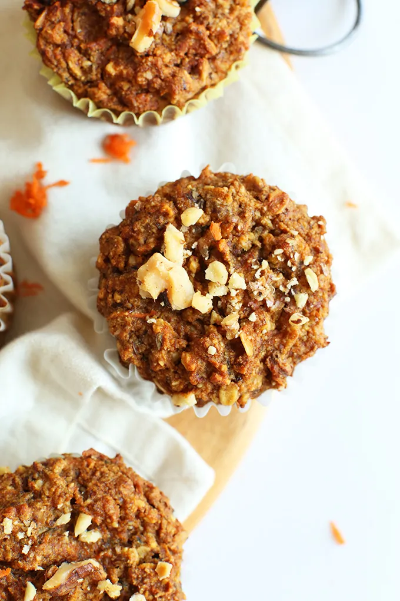

# :cupcake: 1-Bowl Carrot Apple Muffins

{ loading=lazy }

| :timer_clock: Total Time |
|:-----------------------: |
| 51 minutes |

## :salt: Ingredients

- 1.5 Tbsp (8 g) flaxseed meal
- :droplet: 4 Tbsp (57 g) water
- :apple: 0.33 cup (70 g) mashed banana
- :honey_pot: 0.25 cup (84 g) agave or maple syrup
- :olive: 0.25 cup (50 g) olive oil
- :chocolate_bar: 0.5 cup (42 g) unsweetened applesauce
- 0.5 cup [brown sugar][1]
- :chestnut: 1.5 tsp baking soda
- :salt: 0.5 tsp salt
- :chestnut: 0.5 tsp (2 g) cinnamon
- :glass_of_milk: 0.5 cup (42 g) almond milk
- :carrot: 1 heaping cup grated carrot
- :ear_of_rice: 0.67 cup (94 g) oats
- :chestnut: 0.5 cup (42 g) almond meal
- :baby_bottle: 1 heaping cup gluten-free flour blend
- :leafy_green: 0.25 cup (28 g) walnuts (optional)

## :cooking: Cookware

- :bowl_with_spoon: 1 large mixing bowl
- :cookie: 1 muffin tin
- 1 liners
- 1 whisk
- :knife: 1 toothpick

## :pencil: Instructions

### Step 1

Prepare flax eggs in a large mixing bowl by mixing flaxseed meal and water and let rest for a few minutes. Preheat oven
to 375°F (190 C).

### Step 2

Prepare muffin tin with liners or lightly grease them.

### Step 3

To the flax eggs, add mashed banana, agave or maple syrup, olive oil and whisk to combine.

### Step 4

Next add unsweetened applesauce, brown sugar, baking soda, salt, cinnamon, and whisk to combine.

### Step 5

Add almond milk and stir.

### Step 6

Add grated carrot and stir.

### Step 7

Add oats, almond meal, and gluten-free flour blend and stir.

### Step 8

Divide evenly among 12 muffin tins, filling them all the way up to the top, and top with crushed walnuts (optional).

### Step 9

Bake for 32 to 36 minutes, or until deep golden brown and a toothpick inserted into the center comes out clean. When
you press on the top it shouldn’t feel too spongy, so don’t be afraid of over baking! The gluten-free blend just
takes longer to bake.

### Step 10

Remove from oven and let set in the pan for 15 minutes. Then flip on their sides still in the pan to let cool
completely.

### Step 11

If you try to unwrap them too quickly, they have a tendency to stick to the wrappers.

### Step 12

Once cooled, store in a covered container or bag at room temp to keep fresh. Freeze after that to keep fresh.

## :link: Source

- <https://minimalistbaker.com/one-bowl-carrot-apple-muffins-vegan-gf/>

[1]: <../ingredients/brown-sugar.md>
