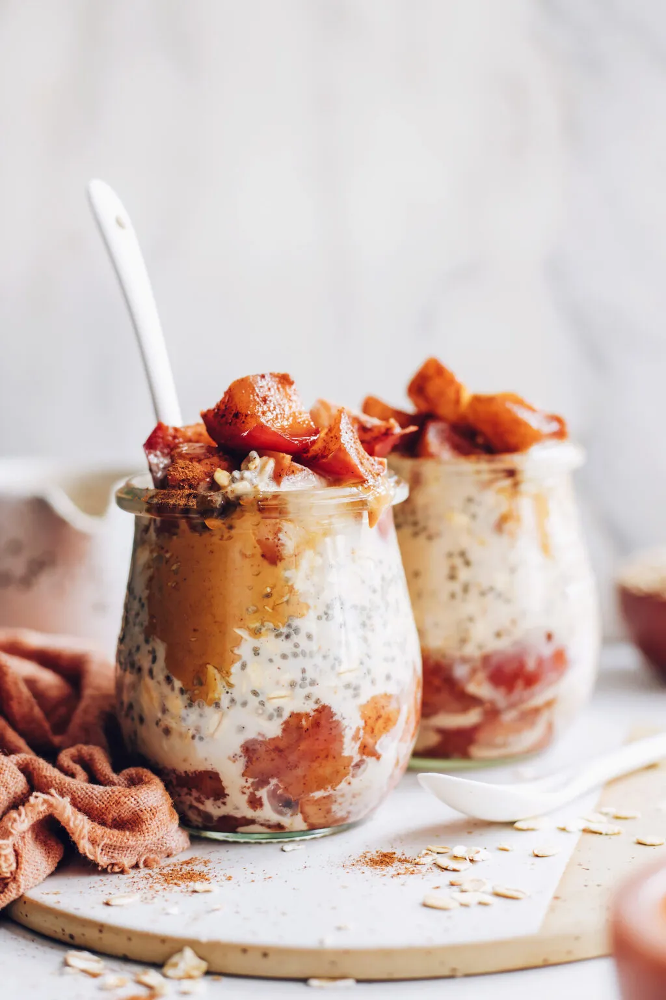

# :green_apple: Apple Pie Overnight Oats

{ loading=lazy }

| :timer_clock: Total Time |
|:-----------------------: |
| 6.22 hours |

## :salt: Ingredients

- :apple: 0.75 cup (64 g) chopped apples
- :chestnut: 0.75 tsp (3 g) cinnamon
- :honey_pot: 2 Tbsp (39 g) maple syrup
- :salt: 1 pinch salt
- :glass_of_milk: 0.75 cup (63 g) almond milk
- :seedling: 1 Tbsp (9 g) chia seeds
- :chestnut: 0.5 tsp (2 g) cinnamon
- :chestnut: 2 Tbsp (34 g) cashew or almond butter
- :flower_playing_cards: 1 tsp vanilla
- :ear_of_rice: 0.5 cup (56 g) rolled oats

## :cooking: Cookware

- :shallow_pan_of_food: 1 small saucepan
- :bowl_with_spoon: 1 small bowl
- 2 small mason

## :pencil: Instructions

### Step 1

APPLES: To a small saucepan, add chopped apples, 3/4 tsp cinnamon, maple syrup, and salt and mix to evenly distribute
the cinnamon.

### Step 2

Turn heat on low and cover. Cook, stirring occasionally, for about 10 minutes or until the apples are soft and tender.
Remove the lid, turn the heat up to medium, and cook for 2 to 3 minutes more, stirring constantly, to evaporate some of
the juices and create a nice syrup around the apples. Once most of the liquid is gone, turn off the heat and set aside.

### Step 3

OATS: In a small bowl or liquid measuring cup, mix the almond milk, chia seeds, maple syrup, 1/2 tsp cinnamon, cashew or
almond butter, and vanilla. Add the rolled oats and stir until well-combined.

### Step 4

Get two small mason jars or small bowls with lids. Place about a quarter of the cooked apple mixture into the bottom of
each container, add half the oat mixture to each as your middle layer, then divide and place the rest of the cooked
apples on top of the oats. Place in the refrigerator overnight, or for at least 6 hours.

### Step 5

Enjoy chilled or at room temperature. Overnight oats will keep in the refrigerator for 2-3 days, though best within the
first 12-24 hours in our experience. Not freezer friendly.

!!! tip

    For more flavor, toast the oats first! See [Toasted Rolled Oats](../ingredients/toasted-rolled-oats.md) for instructions.

## :link: Source

- <https://minimalistbaker.com/apple-pie-overnight-oats/>
