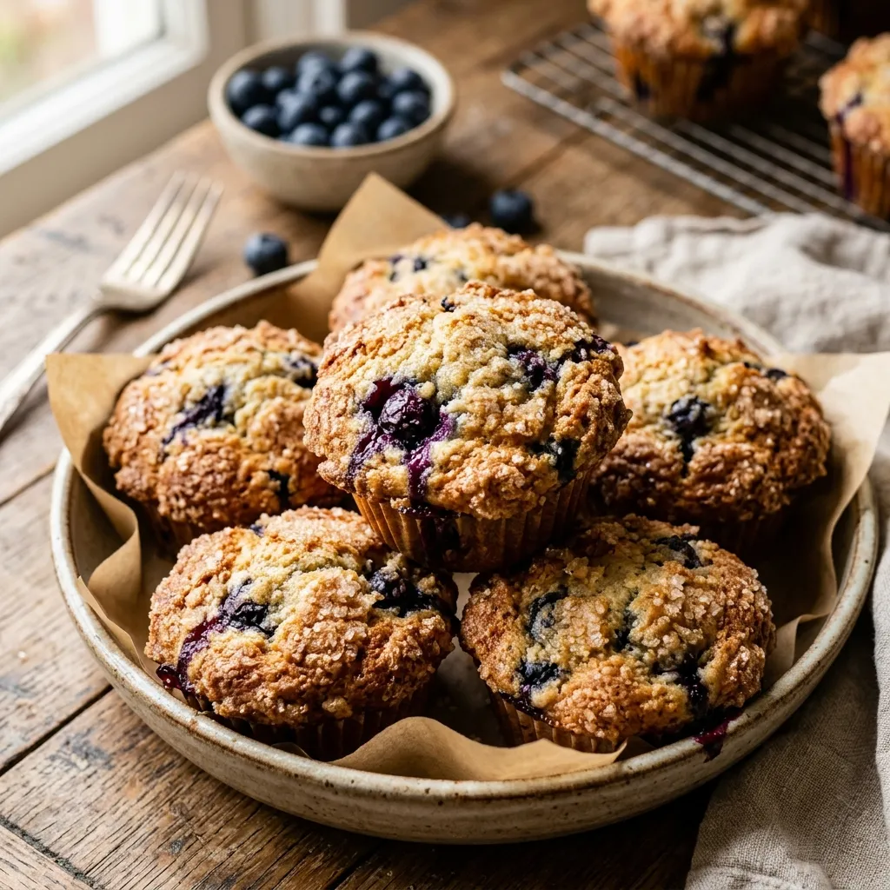

# :cupcake: Blueberry Muffins

{ loading=lazy }

| :fork_and_knife_with_plate: Serves | :timer_clock: Total Time |
|:----------------------------------:|:-----------------------: |
| 12 | 45 minutes |

## :salt: Ingredients

- :baby_bottle: 1/2 cup (113 g) unsalted butter, softened
- :candy: 1 cup (198 g) granulated sugar (plus extra for sprinkling)
- :egg: 2 large eggs
- :chestnut: 2 tsp baking powder
- :salt: 1/2 tsp kosher salt
- :flower_playing_cards: 1 tsp vanilla extract
- :bread: 2 cups (240 g) all-purpose flour
- :glass_of_milk: 1/2 cup (114 g) whole milk
- :baby_bottle: 2 1/2 cups blueberries (fresh preferred)

## :cooking: Cookware

- :cookie: 1 standard 12-cup muffin tin
- :bowl_with_spoon: 1 stand mixer or large mixing bowl
- :bowl_with_spoon: 1 fork or small bowl (for mashing)
- :spoon: 1 rubber spatula
- :wastebasket: 1 wire rack

## :pencil: Instructions

### Step 1

Preheat oven to 375°F. Lightly grease a 12-cup standard muffin tin or line with paper cups and grease the cups.

### Step 2

In a large bowl or the bowl of a stand mixer fitted with the paddle attachment, cream together the softened unsalted butter and granulated sugar until light and fluffy.

### Step 3

Add the large eggs one at a time, beating well after each addition.

### Step 4

Add the baking powder, kosher salt, and vanilla extract, beating until fully incorporated.

### Step 5

Alternately add the all-purpose flour and whole milk, mixing gently until just combined.

### Step 6

Mash 1/2 cup of the blueberries with a fork or your hands. Gently fold the mashed blueberries and the remaining whole blueberries into the batter.

### Step 7

Divide the batter evenly among the prepared muffin cups. Sprinkle each generously with about 1 teaspoon of additional granulated sugar.

### Step 8

Bake at 375°F for 25 to 30 minutes, until the tops are golden brown and a toothpick inserted into the center comes out clean.

### Step 9

Allow to cool in the pan for 5 minutes, then transfer the muffins to a wire rack to cool completely.

## :link: Sources

- <https://www.kingarthurbaking.com/recipes/famous-jordan-marsh-blueberry-muffins-recipe>
- <https://www.thepancakeprincess.com/best-blueberry-muffin-bake-off/>
