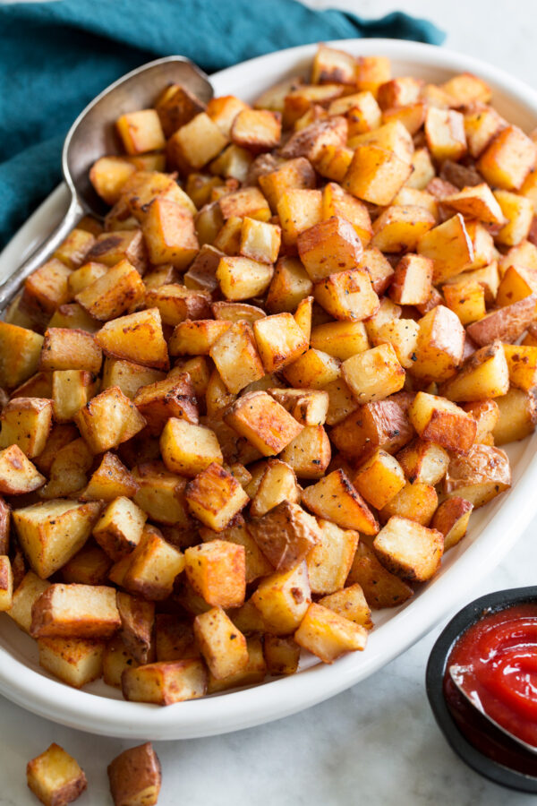

# :potato: Breakfast Potatoes

{ loading=lazy }

| :timer_clock: Total Time |
|:-----------------------: |
| 14 minutes |

## :salt: Ingredients

- :potato: 1.5 lbs red potatoes
- :butter: 4 Tbsp butter
- :garlic: 0.5 tsp garlic powder
- :salt: 1 tsp salt
- :salt: 0.5 tsp pepper

## :cooking: Cookware

- 1 electric skillet
- 1 microwave

## :pencil: Instructions

### Step 1

Heat skillet to medium or an electric skillet to 350°F.

### Step 2

Bake red potatoes in microwave for 5 to 6 minutes. Quarter cooked potatoes, and place butter 1 Tbsp at a time onto hot
skillet.

### Step 3

Once all potatoes are in the skillet, spray the top with olive oil and season with half of the garlic powder, salt, and
pepper.

### Step 4

After about 4 minutes, flip potatoes and repeat the spray and seasoning process and cook 4 minutes more.
