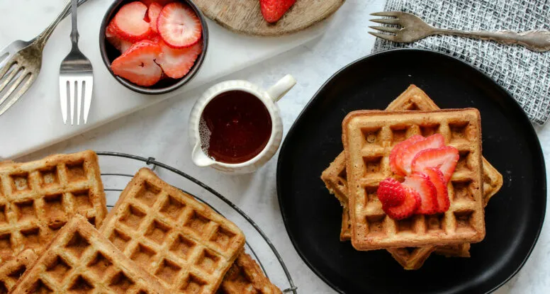

# :waffle: [buttermilk](../ingredients/buttermilk.md) Whole Wheat Waffles

{ loading=lazy }

| :fork_and_knife_with_plate: Serves | :timer_clock: Total Time |
|:----------------------------------:|:-----------------------: |
| 2 | 0 minutes |

## :salt: Ingredients

- :strawberry: some strawberries
- :apple: some raspberries
- :apple: some blackberries
- :apple: some blueberries
- :tangerine: 1 lemon
- :candy: some sugar
- :bread: 0.5 cup (56 g) whole wheat flour
- :bread: 0.5 cup (60 g) all-purpose flour
- :ear_of_rice: 1 Tbsp (9 g) cornmeal
- :salt: 0.25 tsp salt
- :chestnut: 1 tsp baking soda
- :egg: 1 egg
- 1 cup [buttermilk][1]
- :butter: 2.5 Tbsp butter
- :glass_of_milk: some milk
- :honey_pot: some maple syrup

## :cooking: Cookware

- 1 waffle iron
- :bowl_with_spoon: 1 medium bowl
- :bowl_with_spoon: 1 medium bowl

## :pencil: Instructions

### Step 1

Combine strawberries, raspberries, blackberries, and blueberries and then toss gently with a little lemon juice, lemon
zest and then sprinkle with a little sugar to taste. Set aside to macerate while mixing up the waffle ingredients.

### Step 2

Preheat waffle iron.

### Step 3

In a medium bowl, whisk together the whole wheat flour, all-purpose flour, cornmeal, salt, and baking soda.

### Step 4

In another medium bowl, whisk the egg. Add the [buttermilk](../ingredients/buttermilk.md) and the cooled
melted butter and whisk again. Gradually add to the dry ingredients to form a batter and mix gently with a
spoon until combined. Thin batter with a little 2% milk if needed.

### Step 5

Lightly oil the waffle grill and spoon batter into the waffle iron. Cook until golden brown. Serve immediately with
butter, maple syrup and berries. Also, the waffles freeze well.

## :link: Source

- <https://www.bobsredmill.com/recipes/how-to-make/buttermilk-whole-wheat-waffles/>

[1]: ../ingredients/buttermilk.md
