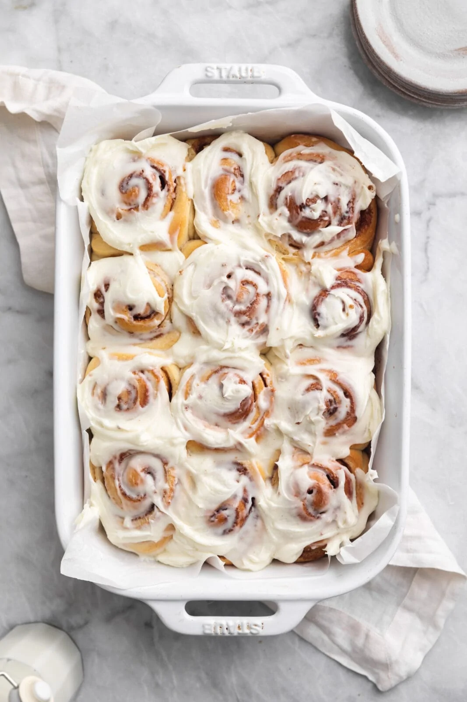

# :doughnut: Cinnamon Rolls

{ loading=lazy }

| :fork_and_knife_with_plate: Serves | :timer_clock: Total Time |
|:----------------------------------:|:-----------------------: |
| 12 | 15 hours |

## :salt: Ingredients - Dough

- :glass_of_milk: 3/4 cup (170 g) whole milk, warmed
- :honey_pot: 1/4 cup (85 g) honey
- :egg: 4 large eggs, room temperature
- :ear_of_rice: 4 cups (568 g) all-purpose flour
- :microbe: 2 1/4 tsp instant yeast
- :salt: 2 tsp salt
- :butter: 10 Tbsp (142 g) unsalted butter, room temperature, cut into pieces

## :salt: Ingredients - Cinnamon Sugar Filling

- :butter: 2 Tbsp (29 g) unsalted butter, melted and cooled
- :maple_leaf: 1/2 cup (100 g) brown sugar, packed
- :custard: 1 Tbsp ground cinnamon
- :salt: 1 pinch salt

## :salt: Ingredients - Cream Cheese Frosting

- :butter: 8 Tbsp (113 g) unsalted butter, room temperature
- :cheese_wedge: 4 oz (114 g) cream cheese, room temperature
- :flower_playing_cards: 1 tsp vanilla extract
- :candy: 1 cup (120 g) confectioners' sugar
- :salt: 1 pinch salt

## :cooking: Cookware

- :bowl_with_spoon: 1 stand mixer or large mixing bowl
- 1 paddle attachment
- 1 dough hook
- 1 greased bowl
- :bowl_with_spoon: 1 small bowl
- :knife: unscented dental floss or a very sharp knife
- 1 9x13-inch baking pan
- :page_facing_up: parchment paper

## :pencil: Instructions - Dough

### Step 1

In a bowl or the bowl of a stand mixer, whisk together the warm whole milk, honey, and large eggs.

### Step 2

Add the all-purpose flour, instant yeast, and salt. Using a paddle attachment, mix on low speed for 2 minutes until a shaggy dough forms.

### Step 3

Let the dough rest for 15 to 20 minutes.

### Step 4

Switch to a dough hook. Knead the dough on medium-low speed for 5 minutes.

### Step 5

With the mixer running, add the unsalted butter one piece at a time, mixing until fully incorporated. Knead for another 5 minutes until the dough is smooth, soft, and slightly sticky.

### Step 6

Place the dough in a greased bowl and cover. Let rise for 30 minutes.

### Step 7

Reach under the dough, pull it up, and fold it over itself. Repeat this folding technique 3 more times at 30-minute intervals (for 2 hours total of rising and folding).

### Step 8

Cover the bowl tightly with plastic wrap and refrigerate overnight (or up to 24 hours).

## :pencil: Instructions - Assembly & Baking

### Step 9

Roll the chilled dough on a well-floured surface into an 18 x 12-inch rectangle.

### Step 10

Brush the dough with 2 tablespoons of melted and cooled unsalted butter.

### Step 11

In a small bowl, mix together the brown sugar, ground cinnamon, and pinch of salt. Sprinkle this mixture evenly over the butter, pressing down gently.

### Step 12

From the long end, roll the dough into a tight log, pinching the seam to seal.

### Step 13

Cut the log into 12 even rolls using unscented dental floss or a very sharp knife. Place the rolls in a greased 9x13-inch baking pan lined with parchment paper.

### Step 14

Cover loosely and let rise in a warm place for 1 to 1.5 hours until puffed and doubled.

### Step 15

Preheat oven to 350°F. Bake the rolls for 25 to 30 minutes until golden brown.

## :pencil: Instructions - Cream Cheese Frosting & Glazing

### Step 16

In a stand mixer fitted with the paddle attachment, beat the unsalted butter and cream cheese until smooth. Beat in the vanilla extract, confectioners' sugar, and a pinch of salt until light and fluffy.

### Step 17

**Double-glaze:** Spread half of the frosting immediately over the warm cinnamon rolls so it melts into the cracks. Allow the rolls to cool for 15 minutes, then spread the remaining frosting over the top.

## :link: Sources

- <https://thevanillabeanblog.com/cinnamon-rolls/>
- <https://www.thepancakeprincess.com/best-cinnamon-roll-bake-off/>
