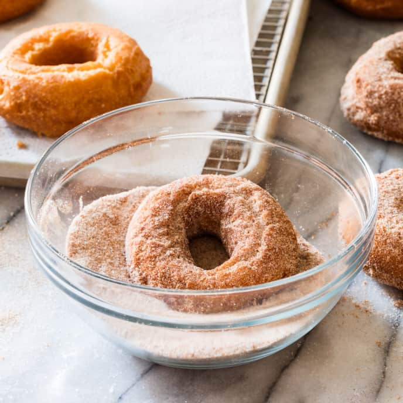

# :doughnut: Cinnamon-Sugared Buttermilk Doughnuts

| :fork_and_knife_with_plate: Serves | :timer_clock: Total Time |
|:----------------------------------:|:-----------------------: |
| 15-17 | 50 minutes |

## :salt: Ingredients

- :ear_of_rice: 3.5 cups all-purpose flour
- :candy: 2 cups sugar
- :rice: 2 tsp baking powder
- :cup_with_straw: 0.5 tsp baking soda
- :chestnut: 1.5 tsp nutmeg
- :salt: 1 tsp salt
- :glass_of_milk: 0.75 cup buttermilk
- :butter: 4 Tbsp butter
- :egg: 2 eggs
- :egg: 1 egg yolk
- :carrot: 6 cups vegetable shortening
- :custard: 1.5 Tbsp cinnamon

## :cooking: Cookware

- 1 stand mixer
- 1 2-cup liquid measuring cup
- 1 wooden spoon or rubber spatula
- 1 large Dutch oven
- 1 rimmed baking sheet
- 1 parchment paper
- 1 rolling pin
- 1 doughnut cutter
- 1 wire rack
- 1 paper towels
- 1 spider skimmer
- 1 small bowl

## :pencil: Instructions

!!! note

    For a bit more flavor, add two ounces of lard to every cup of shortening. You can also add one-quarter cup of flour
    to the recipe, which will produce a chewier doughnut with a less crispy exterior. Regardless, these doughnuts are
    best eaten very warm, as soon out of the pot as possible. The dough can be made by hand, using a large bowl with a
    wooden spoon, or in a mixer as directed. If you don’t have a doughnut cutter, you can use a 3-inch and 1-inch round
    cutter to cut out the dough. Like cookies, doughnuts rolled from scraps will be a little drier and less crisp than
    those cut from the first roll.

### Step 1

Stir 1 cup all-purpose flour, 1 cup sugar, baking powder, baking soda, nutmeg, and salt together in bowl of stand mixer.
Whisk buttermilk, butter, eggs, and egg yolk together in 2-cup liquid measuring cup.

### Step 2

Fit stand mixer with paddle attachment, add wet ingredients to dry and mix on medium speed until smooth, about 30
seconds. Decrease speed to low, add remaining 2.5 cups flour and mix until just combined, about 30 seconds. Stir batter
once or twice with wooden spoon or rubber spatula to ensure that all liquid is incorporated. (The dough will be moist
and tacky, a cross between cake batter and cookie dough.)

### Step 3

Heat vegetable shortening in large Dutch oven over medium-low heat to 375°F. While oil is heating, line rimmed baking
sheet with parchment paper and lightly dust with flour. Turn dough onto well-floured work surface. Roll with heavily
floured rolling pin to 1/2-inch thick. Stamp out dough rings with heavily floured doughnut cutter, reflouring between
cuts. Transfer dough rounds and holes to prepared baking sheet. Gather scraps and gently press into disk; repeat rolling
and stamping process until all dough is used. (Cut doughnuts can be covered with plastic wrap and stored at room
temperature up to 2 hours.)

### Step 4

Set wire rack in second rimmed baking sheet and line with triple layer of paper towels. Using your hands, carefully
place dough rings into hot fat four or five at a time, depending on kettle size, adjusting burner as necessary to
maintain oil temperature between 360 to 365°F. Using spider skimmer, turn doughnuts as they rise to surface. Fry
doughnuts until golden brown, 50 to 60 seconds per side. Drain on prepared baking sheet. Return oil to 375°F and repeat
with remaining doughnuts. For doughnut holes, transfer all to hot oil and stir gently and constantly until golden brown,
about 2 minutes.

### Step 5

Mix remaining 1 cup sugar with cinnamon in small bowl. Cool doughnuts about 1 minute and toss with cinnamon sugar to
coat.

## :link: Source

- <https://www.cooksillustrated.com/recipes/1194-cinnamon-sugared-buttermilk-doughnuts?pac=mWqkH2daP1%2B/nBz33sh7IoL82IfIJ3UVJu36JnPKzwM%3D%0A&extcode=NSYTI16YT>
