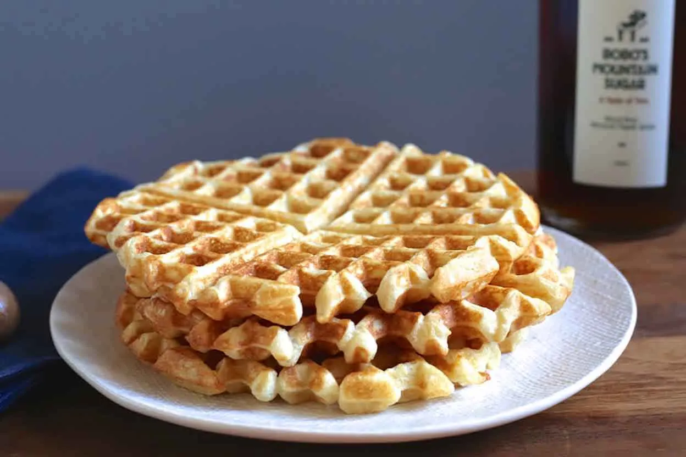

# :waffle: Classic Buttermilk Waffles

{ loading=lazy }

| :fork_and_knife_with_plate: Serves | :timer_clock: Total Time |
|:----------------------------------:|:-----------------------: |
| 4 | 50 minutes |

## :salt: Ingredients

- :ear_of_rice: 1 3/4 cups (210 g) all-purpose flour
- :dash: 2 1/4 tsp baking powder
- :cup_with_straw: 1/4 tsp baking soda
- :corn: 2 Tbsp (16 g) cornstarch
- :candy: 3 Tbsp + 1 tsp (40 g) granulated sugar
- :salt: 1/2 tsp fine sea salt
- :egg: 3 large eggs
- :glass_of_milk: 3/4 cup (180 g) buttermilk
- :glass_of_milk: 3/4 cup (180 g) heavy cream
- :butter: 1/2 cup (113 g) unsalted butter, melted and cooled slightly

## :cooking: Cookware

- :bowl_with_spoon: 2 mixing bowls
- :spoon: 1 wooden spoon
- 1 waffle iron
- :paintbrush: 1 pastry brush

## :pencil: Instructions

### Step 1

In a bowl, whisk together the all-purpose flour, baking powder, baking soda, cornstarch, granulated sugar, and fine sea salt.

### Step 2

In another bowl, whisk together the eggs, buttermilk, and heavy cream.

### Step 3

Using a wooden spoon, stir the wet ingredients into the dry ingredients until a few streaks of flour remain, but the batter is almost mixed together.

### Step 4

Add the unsalted butter and stir until just combined.

!!! important

    Allow the batter to rest for 15 to 30 minutes.

### Step 5

Heat a waffle iron.

### Step 6

Brush butter on both sides of the waffle iron.

### Step 7

Pour about 1/3 cup of batter onto the iron and cook according to the manufacturer's directions.

!!! tip

    Waffles are best consumed as soon as they're baked, but in a pinch you may place them on a rack to cool, wrap
    tightly to store in the refrigerator, then reheat for 6 minutes in a 350°F oven.

## :link: Sources

- <https://ohsweetbasil.com/ultimate-waffle-recipe/>
- <https://www.thepancakeprincess.com/best-buttermilk-waffle-bake-off/>
