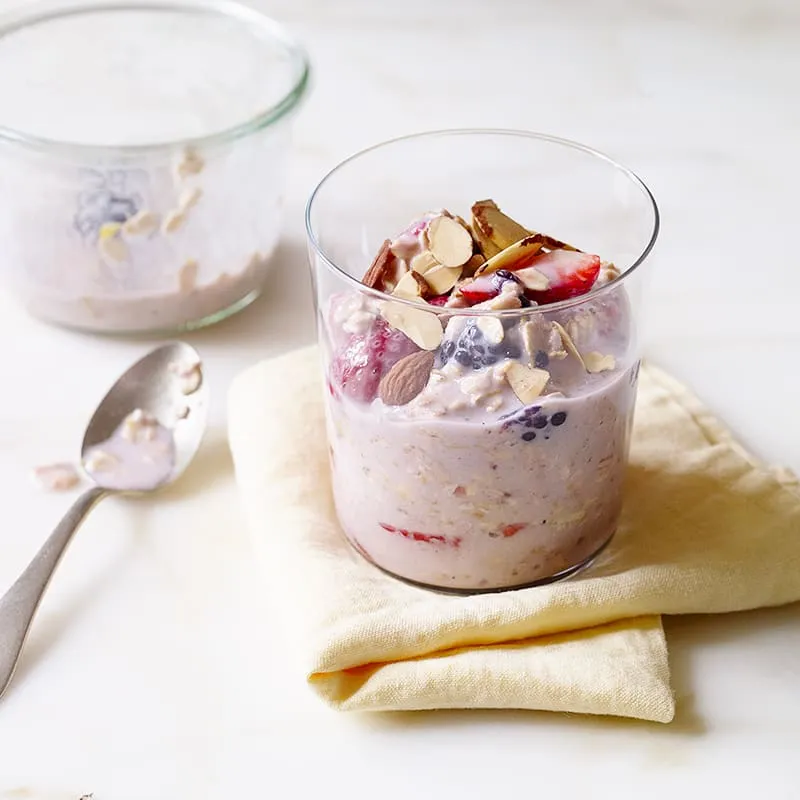

# :ear_of_rice: Double-Berry Overnight Oats

{ loading=lazy }

| :timer_clock: Total Time |
|:-----------------------: |
| 8 hours 10 minutes |

## :salt: Ingredients

=== "serves 3"

    - :ear_of_rice: 1 cup (99 g) uncooked old fashioned oats
    - :glass_of_milk: 1 cup (53 g) unsweetened vanilla almond milk
    - :candy: 1 cup (213 g) light artificially sweetened yogurt
    - :mushroom: 2.25 cup (320 g) mixed berries
    - :tangerine: 1 Tbsp (14 g) lemon zest
    - :chestnut: 0.25 tsp (1 g) cinnamon
    - :salt: 0.25 tsp salt
    - :chestnut: 3 Tbsp (16 g) almonds
    - :seedling: 3 Tbsp (28 g) chia seeds
    - :flower_playing_cards: 1 tsp vanilla

=== "serves 1"

    - :ear_of_rice: 0.33 cup (33 g) uncooked old fashioned oats
    - :glass_of_milk: 0.33 cup (17 g) unsweetened vanilla almond milk
    - :candy: 0.33 cup (70 g) light artificially sweetened yogurt
    - :mushroom: 0.75 cup (106 g) mixed berries
    - :tangerine: 1 tsp (5 g) lemon zest
    - :chestnut: 1 pinch cinnamon
    - :salt: 1 pinch salt
    - :chestnut: 1 Tbsp (5 g) almonds
    - :seedling: 1 Tbsp (9 g) chia seeds
    - :flower_playing_cards: 0.25 tsp vanilla

## :cooking: Cookware

- 1 medium jar or large glass

## :pencil: Instructions

### Step 1

Combine uncooked old fashioned oats, unsweetened vanilla almond milk, light artificially sweetened yogurt, mixed
berries, lemon zest, cinnamon, vanilla, chia seeds, and salt in a medium jar or large glass; stir, cover and
refrigerate overnight. Garish with almonds; serve.

!!! tip

    For more flavor, toast the oats first! See [Toasted Rolled Oats](../ingredients/toasted-rolled-oats.md) for instructions.

## :link: Source

- <https://www.weightwatchers.com/us/recipe/double-berry-overnight-oats/585c27d0d4c2a8c517deece5>
