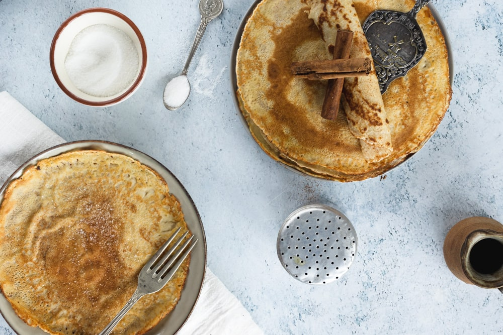

# :pancakes: Dutch Pancakes

| :timer_clock: Total Time |
|:-----------------------: |
| 1.02 hours |

## :salt: Ingredients

- :ear_of_rice: 1.25 cups all-purpose flour
- :egg: 4 eggs
- :glass_of_milk: 1 cup milk
- :ice: 1.25 cups cold water
- :butter: 3 Tbsp butter
- :icecream: 1 tsp vanilla
- :custard: some cinnamon (optional)
- :candy: some sugar (optional)

## :cooking: Cookware

- 1 blender or mixer
- 1 frying pan

## :pencil: Instructions

### Step 1

1 1/4 cups all purpose flour

### Step 2

4 eggs

### Step 3

1 cup milk

### Step 4

1.25 cups cold water

### Step 5

3 tablespoons butter melted

### Step 6

1 tsp. vanilla extract

### Step 7

Mix together all-purpose flour, eggs, milk, cold water, melted butter, and vanilla with a blender or mixer.

### Step 8

If you can let sit for about 1 hour in the refrigerator (that's best).

### Step 9

If you can't wait, then pour about 3 tablespoons at time into a buttered or greased frying pan on medium heat until the
surface is bubbly. Turn over for about 1 minute.

### Step 10

Then put on a plate, sprinkle cinnamon (optional) and sugar (optional) on it and roll up and enjoy.

## :link: Source

- Tante Myrna Seccia
