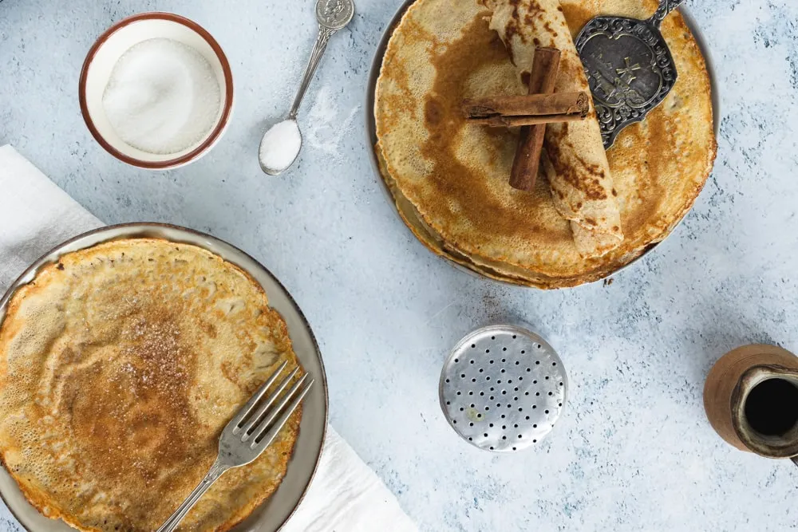

# :pancakes: Dutch Pancakes

{ loading=lazy }

| :timer_clock: Total Time |
|:-----------------------: |
| 1.02 hours |

## :salt: Ingredients

- :bread: 1.25 cups (150 g) all-purpose flour
- :egg: 4 eggs
- :glass_of_milk: 1 cup (227 g) milk
- :baby_bottle: 1.25 cups (284 g) cold water
- :butter: 3 Tbsp butter
- :flower_playing_cards: 1 tsp vanilla
- :chestnut: some cinnamon (optional)
- :candy: some sugar (optional)

## :cooking: Cookware

- :gear: 1 blender or mixer
- 1 frying pan

## :pencil: Instructions

### Step 1

Mix together all-purpose flour, eggs, milk, cold water, melted butter, and vanilla with a blender or mixer.

### Step 2

If you can let sit for about 1 hour in the refrigerator (that's best).

### Step 3

If you can't wait, then pour about 3 tablespoons at time into a buttered or greased frying pan on medium heat until the
surface is bubbly. Turn over for about 1 minute.

### Step 4

Then put on a plate, sprinkle cinnamon (optional) and sugar (optional) on it and roll up and enjoy.

## :link: Source

- Tante Myrna Seccia
