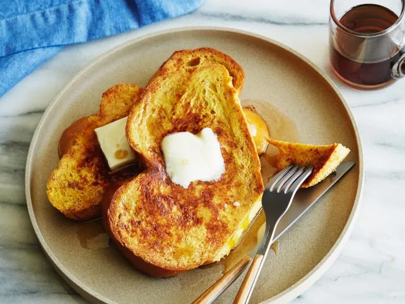

# :bread: French Toast

{ loading=lazy }

| :timer_clock: Total Time |
|:-----------------------: |
| 0 minutes |

## :salt: Ingredients

- :chestnut: 1 tsp (4 g) cinnamon
- :apple: 0.25 tsp nutmeg
- :candy: 2 Tbsp (20 g) sugar
- :butter: 4 Tbsp butter
- :egg: 4 eggs
- :glass_of_milk: 0.25 cup (57 g) milk
- :flower_playing_cards: 0.5 tsp vanilla
- :pie: 8 slices brioche
- :candy: 0.5 cup (156 g) syrup

## :cooking: Cookware

- :bowl_with_spoon: 1 small bowl
- 1 12-inch skillet

## :pencil: Instructions

### Step 1

In a small bowl, combine cinnamon, nutmeg, and sugar and set aside briefly.

### Step 2

In a 10-inch or 12-inch skillet, melt butter over medium heat. Whisk together cinnamon mixture, eggs, milk, and vanilla
and pour into a shallow container such as a pie plate. Dip bread in egg mixture. Fry brioche until golden brown, then
flip to cook the other side. Serve with syrup.

## :link: Source

- <https://www.foodnetwork.com/recipes/robert-irvine/french-toast-recipe-1951408>
