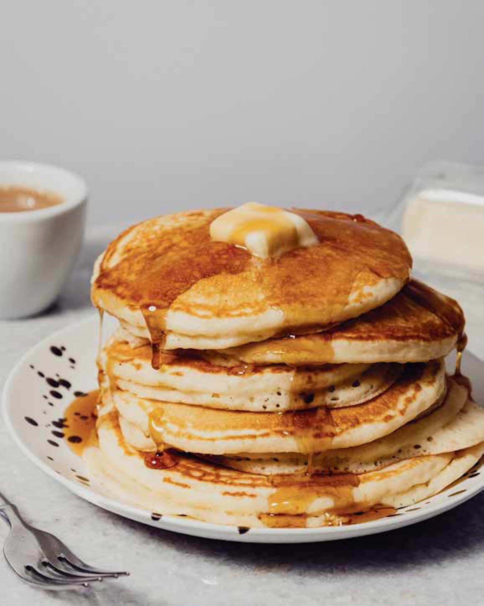

# :pancakes: Joy of Cooking Pancakes

{ loading=lazy }

| :timer_clock: Total Time |
|:-----------------------: |
| 15 minutes |

## :salt: Ingredients

- :ear_of_rice: 1.5 cups (180 g) all-purpose flour
- :salt: 0.5 tsp salt
- :dash: 1.75 tsp baking powder
- :candy: 3 Tbsp sugar
- :egg: 2 eggs
- :butter: 3 Tbsp (42 g) melted butter
- :glass_of_milk: 1 cup (227 ml) milk

## :cooking: Cookware

## :pencil: Instructions

### Step 1

Preheat an electric skillet to 350°F.

### Step 2

Mix all-purpose flour, salt, and baking powder together, mix sugar, eggs, melted butter, and milk together, add wet to
dry and combine quickly. It is okay if lumps exist in the batter.

### Step 3

Let the batter rest for 5 minutes.

### Step 4

Cook the pancakes on the electric skillet covered for 4 minutes on the first side and 3 minutes on the other.

## :link: Source

- <http://recipecircus.com/recipes/cowgirl/QUICKBREADS/Pancakes_from_Joy_of_Cooking.html>
