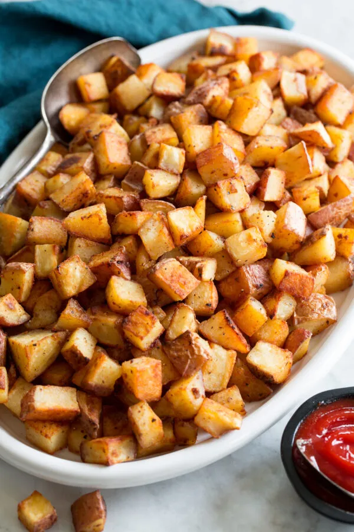

# :potato: Mom's Breakfast Potatoes

{ loading=lazy }

| :fork_and_knife_with_plate: Serves | :timer_clock: Total Time |
|:----------------------------------:|:-----------------------: |
| 6 | 1.28 hours |

## :salt: Ingredients

- :sweet_potato: 6 medium russet potatoes
- :tea: 0.5 cup (48 g) onion
- :butter: 4 Tbsp butter
- :olive: 4 Tbsp (50 g) olive oil
- :apple: 1 tsp dill
- 1 tsp (1 g) chives
- :salt: 1 tsp garlic salt
- :salt: 1 tsp pepper
- :salt: 0.5 tsp salt
- :herb: 1 tsp parsley
- :herb: 1 tsp (2 g) Italian herbs

## :cooking: Cookware

- 1 pan

## :pencil: Instructions

### Step 1

Preheat oven to 400°F.

### Step 2

Scrub and pierce russet potatoes and rub a small amount of oil on the skins. Bake the potatoes for 1 hour.

### Step 3

Cook crushed onion in butter and olive oil, about 2 minutes.

### Step 4

Slice potatoes into 1 inch pieces.

### Step 5

Add butter and olive oil to pan and add potatoes and dill, chives, garlic salt, pepper, salt, parsley, and Italian
herbs.

### Step 6

Cook for 10 to 15 minutes. Season to taste.
