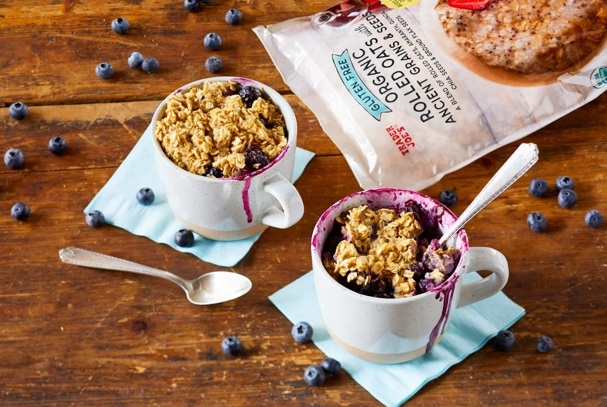

# :cupcake: Morning Muffin In a Mug

{ loading=lazy }

| :fork_and_knife_with_plate: Serves | :timer_clock: Total Time |
|:----------------------------------:|:-----------------------: |
| 1 | 10 minutes |

## :salt: Ingredients

- :baby_bottle: 0.5 cup (85 g) TJ’s Gluten Free Organic Rolled Oats with Ancient Grains & Seeds
- 0.25 cup (64 g) applesauce
- :honey_pot: 2 Tbsp honey
- :salt: 0.13 tsp salt
- :chestnut: 0.25 tsp baking powder
- :chestnut: 0.25 tsp (1 g) cinnamon
- :egg: 1 egg
- 1 handful berries

## :cooking: Cookware

- 1 coffee mug

## :pencil: Instructions

### Step 1

Mix TJ’s Gluten Free Organic Rolled Oats with Ancient Grains & Seeds, applesauce, honey, salt, baking powder,
cinnamon, egg, and berries in a coffee mug. Stir well until thoroughly combined.

### Step 2

In a microwave oven, heat on high for 4 minutes*, or until mixture is no longer wet on the surface. The muffin will
expand as it cooks and may partially rise out of the mug.

### Step 3

Carefully remove the mug from the microwave, as it will be very hot, and let cool for about 5 minutes. Top with some
fresh berries (optional), drizzle with more honey if desired, and serve.

!!! tip

    For more flavor, toast the oats first! See [Toasted Rolled Oats](../ingredients/toasted-rolled-oats.md) for instructions.

## :link: Source

- <https://www.traderjoes.com/home/recipes/morning-muffin-in-a-mug>
