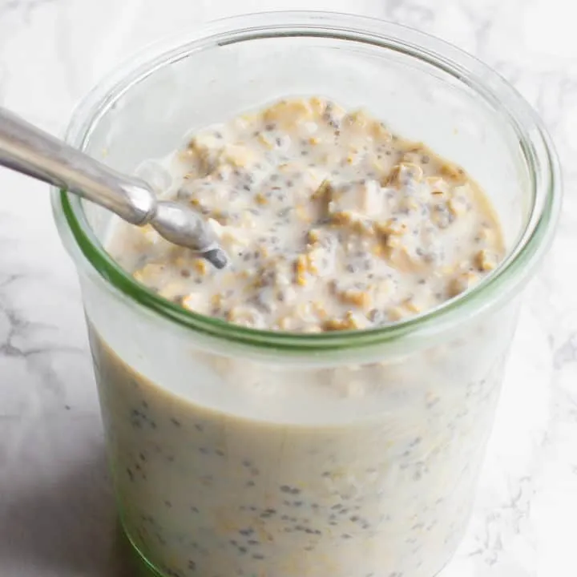

# :ear_of_rice: Overnight Oats

{ loading=lazy }

| :timer_clock: Total Time |
|:-----------------------: |
| 5 minutes |

## :salt: Ingredients

=== ":ear_of_rice: 0.5 cup old fashioned rolled oats"

    - :seedling: 1 Tbsp (9 g) chia seeds
    - :coconut: 0.5 cup (57 g) almond or coconut milk

=== "Optional Add-Ins"

    - :chestnut: some chopped nuts (almonds, walnuts, pistachios, pecans, etc.)
    - :chestnut: some nut butters (peanut butter, almond butter, etc.)
    - :apple: some dried fruits
    - :herb: some fresh fruit
    - :chestnut: - some cinnamon
    - :flower_playing_cards: some vanilla
    - :chocolate_bar: some cocoa powder
    - :hot_pepper: some unsweetened dried coconut flakes
    - :chocolate_bar: some unsweetened applesauce
    - :melon: some canned pumpkin

## :pencil: Instructions

### Step 1

Combine old fashioned rolled oats, chia seeds, and almond or coconut milk together and refrigerate overnight or for at
least 3 hours before enjoying.

!!! info "Optional add-ins"

    Optional add-ins include chopped nuts (almonds, walnuts, pistachios, pecans, etc.), nut butters (peanut butter,
    almond butter, etc.), dried fruits, fresh fruit, cinnamon, vanilla, cocoa powder, unsweetened dried coconut flakes,
    unsweetened applesauce, and canned pumpkin.

!!! note

    The possibilities for flavor combinations are endless! For extra convenience, make enough servings for the whole
    week & store in the refrigerator until ready to enjoy.

!!! tip

    For more flavor, toast the oats first! See [Toasted Rolled Oats](../ingredients/toasted-rolled-oats.md) for instructions.

## :link: Source

- Marissa Kent Nutrition
