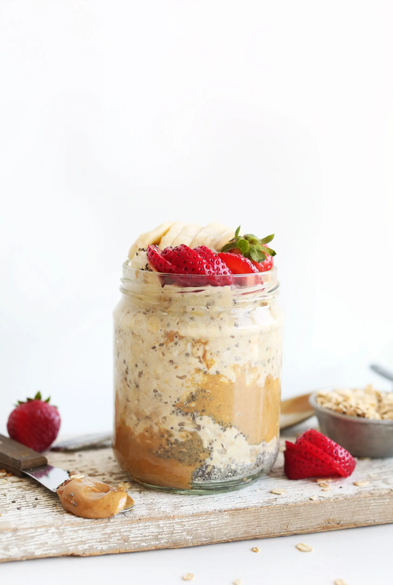

# :peanuts: Peanut Butter Overnight Oats

{ loading=lazy }

| :timer_clock: Total Time |
|:-----------------------: |
| 6.00 hours |

## :salt: Ingredients

=== "serves 4"

    - :glass_of_milk: 2 cups (168 g) almond milk
    - :seedling: 3 Tbsp (28 g) chia seeds
    - 0.5 cups [peanut butter](../ingredients/peanut-butter.md)
    - :flower_playing_cards: 1 tsp vanilla
    - :honey_pot: 4 Tbsp (78 g) maple syrup
    - :ear_of_rice: 2 cups (226 g) rolled oats

=== "serves 1"

    - :glass_of_milk: 0.5 cup (42 g) almond milk
    - :seedling: 0.75 Tbsp (7 g) chia seeds
    - 2 Tbsp [peanut butter](../ingredients/peanut-butter.md)
    - :flower_playing_cards: 0.25 tsp vanilla
    - :honey_pot: 1 Tbsp (20 g) maple syrup
    - :ear_of_rice: 0.5 cup (56 g) rolled oats

## :cooking: Cookware

- 1 mason jar

## :pencil: Instructions

### Step 1

To a mason jar or small bowl with a lid, add almond milk, chia seeds, peanut butter, vanilla, and maple syrup (or other
sweetener) and stir with a spoon to combine. The peanut butter doesn't need to be completely mixed with the almond milk
(doing so leaves swirls of peanut butter to enjoy the next day).

### Step 2

Add rolled oats and stir a few more times. Then press down with a spoon to ensure all oats have been moistened and are
immersed in almond milk.

### Step 3

Cover securely with a lid or seal and set in the refrigerator overnight (or for at least 6 hours) to set/soak.

### Step 4

The next day, open and enjoy as is or garnish with desired toppings (see options above). See more flavor/topping
suggestions in the blog post above!

### Step 5

OPTIONAL: You can also heat your oats in the microwave for 45-60 seconds (just ensure there's enough room at the top of
your jar to allow for expansion and prevent overflow), or transfer oats to a saucepan and heat over medium heat until
warmed through. Add more liquid as needed if oats get too thick/dry.

### Step 6

Overnight oats will keep in the refrigerator for 2-3 days, though best within the first 12-24 hours in our experience.
Not freezer friendly.

!!! tip

    For more flavor, toast the oats first! See [Toasted Rolled Oats](../ingredients/toasted-rolled-oats.md) for instructions.

## :link: Source

- <https://minimalistbaker.com/peanut-butter-overnight-oats/>
