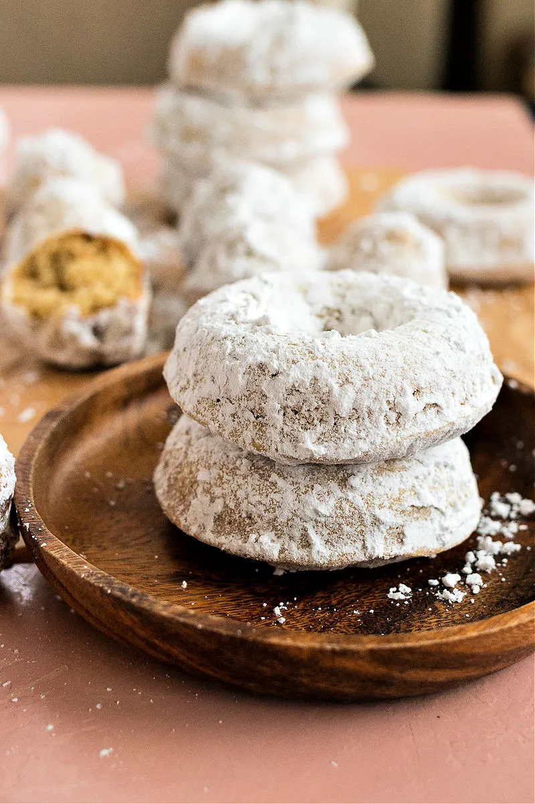

# :doughnut: Powdered Sugar Doughnuts

{ loading=lazy }

| :fork_and_knife_with_plate: Serves | :timer_clock: Total Time |
|:----------------------------------:|:-----------------------: |
| 1 dozen | 30 minutes |

## :salt: Ingredients

- :butter: 0.25 cup (56 g) unsalted butter
- :olive: 0.25 cup (50 g) vegetable oil
- :candy: 0.5 cup (99 g) granulated sugar
- :candy: 0.33 cup (70 g) light brown sugar
- :egg: 2 large eggs
- :flower_playing_cards: 1 tsp vanilla
- :chestnut: 1.5 tsp baking powder
- :chestnut: 0.25 tsp baking soda
- :apple: 0.75 tsp nutmeg
- :chestnut: 1 tsp (4 g) cinnamon
- :salt: 0.75 tsp salt
- :bread: 2.66 cups (319 g) all-purpose flour
- :glass_of_milk: 1 cup (227 g) milk

## :cooking: Cookware

- 1 doughnut pans
- :cookie: 1 12-cup mini muffin tin
- :bowl_with_spoon: 1 medium-sized mixing bowl

## :pencil: Instructions

### Step 1

Preheat the oven to 425°F. Lightly grease doughnut pans and 12-cup mini muffin tin.

### Step 2

In a medium-sized mixing bowl, cream together the melted unsalted butter, vegetable oil, and granulated sugar, and light
brown sugar till smooth. Add the eggs, beating to combine. Add the vanilla and stir to combine.

### Step 3

In a separate bowl. stir the baking powder, baking soda, nutmeg, cinnamon, salt, and all-purpose flour until well
combined. Add 1/3 of the mixture at a time to the butter mixture alternately with the milk, beginning and ending with
the flour and making sure everything is thoroughly combined.

### Step 4

Spoon the batter into a pastry bag without a tip. Squeeze into the doughnut molds, filling the cups nearly full. Bake
the doughnuts for 5 minutes and then drop temperature to 375°F. Continue to bake for 10 more minutes, or until
they’re a pale golden brown and a cake tester inserted into the middle of one of the center muffins comes out clean.
(Only bake 7 more minutes if they are in a mini muffin tin)

### Step 5

In a medium bowl, add the powdered sugar. Melt the butter in a separate small bowl. When muffins have cooled slightly,
roll the doughnuts/doughnut holes in the butter and then the powdered sugar. Cover in powdered sugar until completely
coated. This may take a couple coats of powdered sugar.

### Step 6

Serve immediately or within 24 hours.

## :link: Source

- <https://www.certifiedpastryaficionado.com/powdered-sugar-doughnuts/>
