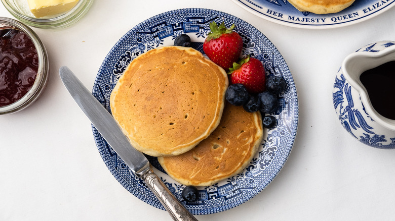

# :pancakes: Queen Elizabeth II's Drop Scones

{ loading=lazy }

| :fork_and_knife_with_plate: Serves | :timer_clock: Total Time |
|:----------------------------------:|:-----------------------: |
| 16 | 25 minutes |

## :salt: Ingredients

- :candy: 4 Tbsp sugar
- :egg: 2 large eggs
- :glass_of_milk: 1.5 cups whole milk
- :ear_of_rice: 3 cups all-purpose flour
- :cup_with_straw: 2 tsp baking soda
- :rice: 3 tsp cream of tartar
- :butter: 2 Tbsp butter

## :cooking: Cookware

- 1 large bowl
- 1 balloon whisk
- 1 griddle or large cast-iron pan

## :pencil: Instructions

### Step 1

In a large bowl, combine the sugar, eggs, and 3/4 cup of whole milk.

### Step 2

Using a balloon whisk, beat the ingredients until they are well combined.

### Step 3

Add the all-purpose flour, baking soda, and cream of tartar to the bowl. Mix them into the wet ingredients until a thick
paste forms.

### Step 4

Add the rest of the milk a bit at a time while whisking, until the mixture is smooth and slowly drips off a spoon.

### Step 5

Discard any remaining milk and fold in the melted butter.

### Step 6

Heat a griddle or large cast-iron pan on medium-low heat.

### Step 7

Once the cooking surface is preheated, drop a few heaping tablespoons of batter into the pan. The drop scones will
spread as they cook, so leave 1 to 2 inches between each scone and cook in batches if need be.

### Step 8

After about 2 minutes, the tops of the drop scones will begin to form bubbles. Gently lift the scones to check that the
bottoms are golden brown, then flip them over to cook the other side for 1 minute.

### Step 9

Once cooked, place the drop scones onto a plate and cover them with a tea towel to keep them warm while you cook the
rest.

### Step 10

Serve the drop scones with classic sides such as butter, jam, golden or maple syrup, and fresh berries.

## :link: Source

- <https://www.tastingtable.com/1003403/queen-elizabeth-iis-drop-scones-recipe/>
