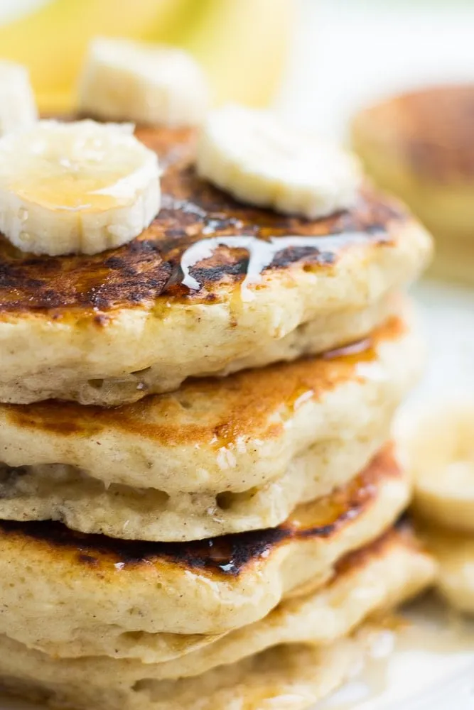

# :pancakes: Vegan Banana Pancakes

{ loading=lazy }

| :timer_clock: Total Time |
|:-----------------------: |
| 25 minutes |

## :salt: Ingredients

=== "serves 6"

    - :apple: 0.5 cup (1) banana
    - :takeout_box: 1 cup (140 g) soy milk
    - :droplet: 2 Tbsp (25 g) canola oil or applesauce
    - :candy: 2 Tbsp (25 g) granulated sugar
    - :flower_playing_cards: 1 tsp vanilla
    - :bread: 1.5 cups (170 g) whole wheat flour
    - :chestnut: 1 Tbsp baking powder
    - :salt: 0.5 tsp salt
    - :chestnut: 0.5 tsp (1 g) cinnamon (optional)

=== "serves 12"

    - :apple: 1 cup (227 g) (2) bananas
    - :takeout_box: 2 cup (280 g) soy milk
    - :droplet: 4 Tbsp (50 g) canola oil or applesauce
    - :candy: 4 Tbsp (50 g) granulated sugar
    - :flower_playing_cards: 2 tsp vanilla
    - :bread: 3 cups (339 g) whole wheat flour
    - :chestnut: 2 Tbsp baking powder
    - :salt: 1 tsp salt
    - :chestnut: 1 tsp (3 g) cinnamon (optional)

## :cooking: Cookware

- :bowl_with_spoon: 1 medium bowl
- :spoon: 1 wooden spoon
- 1 large griddle or pan

## :pencil: Instructions

### Step 1

In a medium bowl, mash the banana. Use a measuring cup to make sure you have about 1/2 cup mashed banana.

### Step 2

Now add the soy milk, canola oil, granulated sugar and vanilla. Whisk until well combined.

### Step 3

Add the whole wheat flour to the wet ingredients, then sprinkle the baking powder, salt, and cinnamon (optional) (if
using) on top of the flour. Mix until just combined with a wooden spoon. The batter will be lumpy.

### Step 4

Heat a large griddle or pan over medium-high heat. Drop about 1/3 cup of the batter onto the griddle. Cook until bubbles
form, then flip and cook until golden brown on the other side, about 1 to 2 minutes. Repeat with all the remaining
batter.

### Step 5

Serve with vegan butter, pure maple syrup and more sliced bananas. These pancakes freeze well, and the recipe can be
easily double, tripled or quadrupled.

!!! note

    May sub any non-dairy milk for the soy milk.

!!! note

    May omit oil if needed, or sub applesauce.

!!! note

    For gluten free, try a gluten free mix such as Bob's Red Mill 1:1.

## :link: Source

- <https://www.noracooks.com/vegan-banana-pancakes/>
