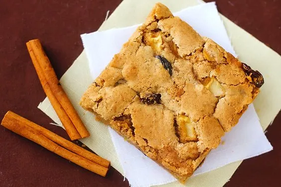

# :apple: Apple Cinnamon Raisin Bars

{ loading=lazy }

| :timer_clock: Total Time |
|:-----------------------: |
| 35 minutes |

## :salt: Ingredients

- :bread: 2 cups (184 g) flour
- :chestnut: 2 tsp baking powder
- :chestnut: 1.5 tsp (6 g) cinnamon
- :salt: 0.5 tsp salt
- :candy: 2 cups (340 g) [light brown sugar][1]
- :egg: 2 eggs
- :butter: 0.5 cup (113 g) unsalted butter
- :flower_playing_cards: 1 tsp vanilla
- :apple: 1.5 cup (128 g) diced apples
- :grapes: 0.75 cup (112 g) raisins

## :cooking: Cookware

- 1 9 X 13 pan
- :bowl_with_spoon: 1 medium bowl
- :bowl_with_spoon: 1 large bowl

## :pencil: Instructions

### Step 1

Heat oven to 350°F. Coat a 9 X 13 pan. In a medium bowl, whisk together flour, baking powder, cinnamon, and salt; set
aside.

### Step 2

In a large bowl, blend light brown sugar, eggs, unsalted butter, and vanilla.

### Step 3

Gradually add flour mixture. Stir in diced apples and raisins, and spread into pan.

### Step 4

Bake for 35 minutes.

## :link: Source

- Recipe Box

[1]: <../ingredients/brown-sugar.md>
