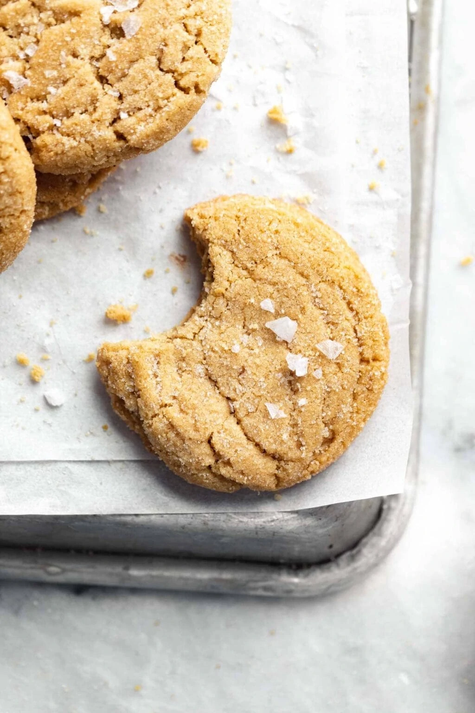

# :peanuts: Broma Bakery Chewy Peanut Butter Cookies

| :fork_and_knife_with_plate: Serves | :timer_clock: Total Time |
|:----------------------------------:|:-----------------------: |
| 3 dozen | 22 minutes |

## :salt: Ingredients

- :butter: 0.25 cup unsalted butter
- :peanuts: 0.75 cup [creamy peanut butter][1]
- :candy: 0.25 cup white sugar
- :maple_leaf: 1 cup [brown sugar][2]
- :egg: 1 egg
- :egg: 1 egg yolk
- :icecream: 2 tsp vanilla
- :ear_of_rice: 18 Tbsp flour
- :cup_with_straw: 0.75 tsp baking soda
- :salt: 1 tsp salt

## :cooking: Cookware

- 1 baking sheet
- 1 parchment paper
- 1 stand mixer
- 1 bowl

## :pencil: Instructions

### Step 1

Preheat the oven to 350°F and line a baking sheet with parchment paper. Set aside.

### Step 2

In a stand mixer fit with the paddle attachment, beat the softened unsalted butter, [creamy peanut butter][1], white sugar
and [brown sugar][2] together until light and fluffy.

### Step 3

Scrape down the bowl and add the egg, egg yolk and vanilla extract. Mix well.

### Step 4

In a separate bowl sift together the flour, baking soda, and salt. Add the dry ingredients to the wet ingredients and
mix until just combined.

### Step 5

Pour some extra granulated sugar into a small bowl. Using a cookie scoop, scoop the dough out into 1 inch balls, rolling
them in the granulated sugar first before  dropping them 2 inches apart on the prepared cookie sheet. Bake at 350°F for
12 minutes or until the cookies have puffed up and are set on the edges, but are still gooey in the middle. Allow to
cool completely before eating!

## :link: Source

- <https://bromabakery.com/chewy-peanut-butter-cookies/>

[1]: <../ingredients/peanut-butter.md>
[2]: <../ingredients/brown-sugar.md>
