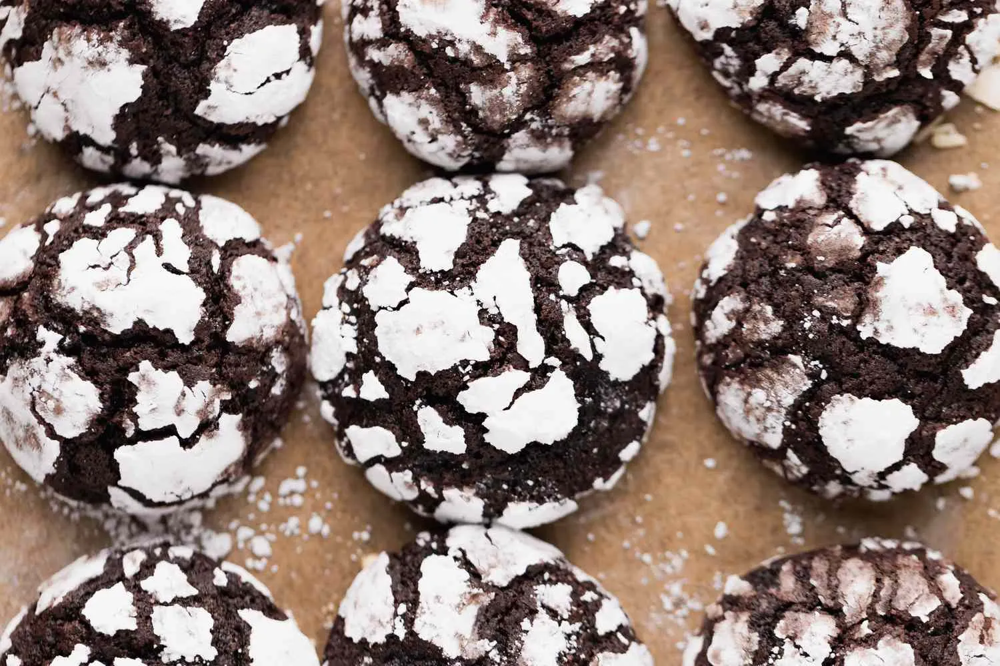

# :cookie: Chocolate Crinkles

{ loading=lazy }

| :fork_and_knife_with_plate: Serves | :timer_clock: Total Time |
|:----------------------------------:|:-----------------------: |
| 6 dozen | 12 minutes |

## :salt: Ingredients

- :olive: 0.5 cup (99 g) vegetable oil
- :baby_bottle: 4 oz (142 g) melted unsweetened chocolate
- :candy: 2 cups (396 g) granulated sugar
- :egg: 4 eggs
- :flower_playing_cards: 2 tsp vanilla
- :bread: 2 cups (240 g) all-purpose flour
- :chestnut: 2 tsp baking powder
- :salt: 0.5 tsp salt
- :candy: 1 cup (113 g) confectioners' sugar

## :cooking: Cookware

- :cookie: 1 baking sheet

## :pencil: Instructions

### Step 1

Mix vegetable oil, melted unsweetened chocolate, and granulated sugar.

### Step 2

Blend in one egg at a time until well blended.

### Step 3

Add vanilla.

### Step 4

Stir all-purpose flour, baking powder, and salt into oil mixture.

### Step 5

Chill for several hours or overnight.

### Step 6

Preheat oven to 350°F.

### Step 7

Drop teaspoonfuls of dough into confectioners' sugar.

### Step 8

Roll in sugar and shape into balls.

### Step 9

Place about 2 inches apart on greased baking sheet.

### Step 10

Bake 10 to 12 minutes.

!!! note

    Do not overbake.

## :link: Source

- Grandma Beatrice Wilde
