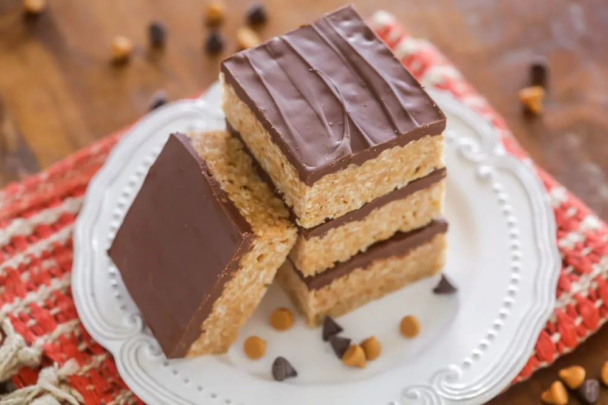

# :cookie: Chocolate Scotcheroos

{ loading=lazy }

| :timer_clock: Total Time |
|:-----------------------: |
| 0 minutes |

## :salt: Ingredients

- :candy: 1 cup (198 g) granulated sugar
- :candy: 1 cup (312 g) light corn syrup
- 1 cup [peanut butter][1]
- :wine_glass: 6 cups (168 g) Rice Krispies
- :chocolate_bar: 1 cup (170 g) chocolate chips
- :ribbon: 1 cup (177 g) butterscotch chips

## :cooking: Cookware

- :shallow_pan_of_food: 1 3-quart saucepan
- 1 9x13 pan

## :pencil: Instructions

### Step 1

Combine sugar and light corn syrup in a 3-quart saucepan. Cook over medium heat, stirring frequently, until mixture
begins to bubble. Remove from heat.

### Step 2

Stir in peanut butter; mix well.

### Step 3

Add Rice Krispies; stir until blended.

### Step 4

Press mixture into greased 9x13 pan.

### Step 5

Melt chocolate chips and butterscotch chips together, stirring until well blended.

### Step 6

Remove from heat; spread evenly over Rice Krispie mixture.

### Step 7

Cool until firm.

## :link: Source

- Recipe Box

[1]: <../ingredients/peanut-butter.md>
