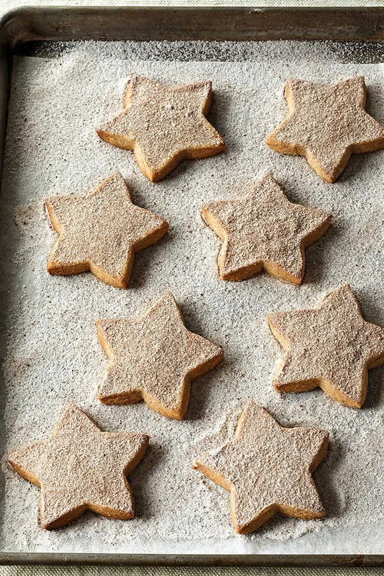

# :cookie: Cinnamon-Spiced Shortbread

{ loading=lazy }

| :timer_clock: Total Time |
|:-----------------------: |
| 52 minutes |

## :salt: Ingredients

=== "Shortbread"

    - :butter: 1.5 cups (339 g) unsalted butter
    - :candy: 200 g granulated sugar
    - :droplet: 1 Tbsp (14 g) warm water
    - :flower_playing_cards: 1 tsp vanilla
    - :bread: 420 g all-purpose flour
    - :chestnut: 2 tsp (8 g) cinnamon
    - :salt: 1 tsp salt

=== "Sugar Coating"

    - :candy: 100 g granulated sugar
    - :chestnut: 0.5 tsp (2 g) cinnamon
    - :apple: 0.5 tsp nutmeg
    - :chestnut: 0.25 tsp cloves

## :cooking: Cookware

- :gear: 1 stand mixer
- :package: 1 plastic wrap
- 1 large (3 1/2") star cutter
- :page_facing_up: 1 parchment
- :cookie: 1 baking sheets
- :bowl_with_spoon: 1 medium bowl

## :pencil: Instructions - Shortbread

### Step 1

Shortbread: Preheat oven to 350°F. In the large bowl of a stand mixer fitted with the paddle attachment, beat unsalted
butter, granulated sugar, warm water, and vanilla on low speed until just combined (make sure that you don’t whip
it!). In a medium bowl, sift all-purpose flour, cinnamon, and salt and whisk to combine. With mixer still on low speed,
slowly add dry ingredients to butter mixture, beating just until dough comes together in large clumps.

### Step 2

Turn out dough onto a floured surface and shape into a flat disk.

### Step 3

Wrap in plastic wrap and chill until cold, about 30 minutes.

### Step 4

On a floured board, roll dough to 1/2" thick. Cut with a large (3 1/2") star cutter or any other shape you like! Arrange
dough on 2 parchment-lined baking sheets, spacing 1" apart.

### Step 5

Bake shortbread until edges just begin to brown, 20 to 22 minutes.

## :pencil: Instructions - Sugar Coating

### Step 6

In a medium bowl, combine granulated sugar, cinnamon, nutmeg, and cloves.

### Step 7

As soon as cookies come out of the oven, generously sprinkle with sugar mixture. Let cool on sheets. Shake off any
excess sugar mixture and serve warm or at room temperature.

## :link: Source

- <https://www.delish.com/cooking/recipe-ideas/a41830806/cinnamon-spiced-shortbread-recipe/>
