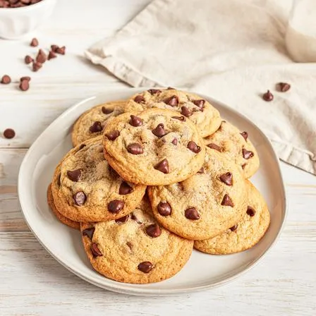

# :cookie: Consumer Union Chocolate Chip Cookies

{ loading=lazy }

| :timer_clock: Total Time |
|:-----------------------: |
| 11 minutes |

## :salt: Ingredients

=== "Half Batch"

    - :candy: 0.375 cup (74 g) granulated sugar
    - :candy: 0.375 cup (80 g) [light brown sugar](../ingredients/brown-sugar.md)
    - :egg: 1 egg
    - :butter: 1 stick unsalted butter
    - :flower_playing_cards: 0.5 tsp vanilla
    - :bread: 1.125 cups (135 g) all-purpose flour
    - :chestnut: 0.5 tsp baking soda
    - :salt: 0.5 tsp salt
    - :chestnut: 0.5 12 oz pkg semi-sweet chocolate chips
    - :chestnut: some walnuts

=== "Full Batch"

    - :candy: 0.75 cup (148 g) granulated sugar
    - :candy: 0.75 cup (160 g) [light brown sugar](../ingredients/brown-sugar.md)
    - :egg: 2 eggs
    - :butter: 2 sticks unsalted butter
    - :flower_playing_cards: 1 tsp vanilla
    - :bread: 2.25 cups (270 g) all-purpose flour
    - :chestnut: 1 tsp baking soda
    - :salt: 1 tsp salt
    - :chestnut: 1 12 oz pkg semi-sweet chocolate chips
    - :chestnut: some walnuts

## :cooking: Cookware

- 1 mixer
- 1 cooking sheet
- :page_facing_up: 1 parchment paper

## :pencil: Instructions

### Step 1

Mix granulated sugar, brown sugar, eggs, unsalted butter, and vanilla with mixer.

### Step 2

Blend flour, baking soda, and salt with whisk. Stir into wet ingredients. Stir in semi-sweet chocolate chips and
walnuts, if desired.

### Step 3

Portion cookies out in 3 Tbsp (60 g) measurements. Bake on lightly greased cooking sheet or parchment paper. Bake at
375°F for approximately 9 to 11 minutes.

## :link: Sources

- Consumer Union
- Recipe Box
