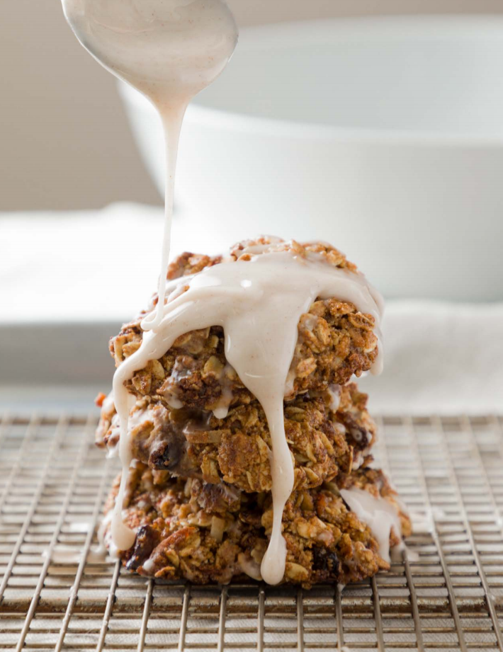

# :carrot: Healthy Carrot Cookies

{ loading=lazy }

| :fork_and_knife_with_plate: Serves | :timer_clock: Total Time |
|:----------------------------------:|:-----------------------: |
| 12 | 19 minutes |

## :salt: Ingredients - Cookie

- :ear_of_rice: 0.75 cup (72 g) almond flour
- :cup_with_straw: 0.5 tsp baking soda
- :custard: 1.5 tsp cinnamon
- :chestnut: 0.13 tsp nutmeg
- :salt: 0.25 tsp salt
- :coconut: 0.25 cup coconut oil
- :maple_leaf: 0.5 cup (107 g) brown or coconut sugar
- :egg: 1 egg
- :icecream: 1 tsp vanilla
- :carrot: 1 cup shredded carrots
- :ear_of_rice: 1.25 (124 g) cups rolled oats
- :coconut: 0.33 cup unsweetened coconut
- :chestnut: 0.25 cup pecans or walnuts
- :grapes: 0.25 cup raisins

## :salt: Ingredients - Icing

- :candy: 0.25 cup (28 g) confectioners' sugar
- :glass_of_milk: 2 tsp [unsweetened oat milk][1]
- :custard: 1 dash cinnamon

## :cooking: Cookware

- 1 baking sheet
- 1 parchment paper
- 1 medium bowl
- 1 large bowl
- 1 large spoon
- 1 bowl

## :pencil: Instructions

### Step 1

Preheat oven to 350°F. Line a baking sheet with parchment paper.

### Step 2

In a medium bowl, mix almond flour, baking soda, cinnamon, nutmeg, and salt.

### Step 3

In a separate large bowl, mix together the melted and cooled coconut oil, brown or coconut sugar, egg and vanilla until
well combined. Then fold in the shredded carrots and add in the flour mixture. Mix with a large spoon until ingredients
are combined. Fold in rolled oats, unsweetened coconut, chopped pecans or walnuts, and raisins.

### Step 4

Roll the mixture into small balls and place on a prepared baking sheet. Gently flatten with your hand.

### Step 5

Bake 9 to 11 minutes or until golden brown.

### Step 6

Allow cookies to cool for a few minutes.

### Step 7

To make the glaze, combine the confectioners' sugar, 1 to 2 tsp [unsweetened oat milk][1] and cinnamon in a bowl.
Drizzle a small amount over cookies, then let dry.

## :link: Source

- Applied Kitchen

[1]: <../beverages/oat-milk.md>
