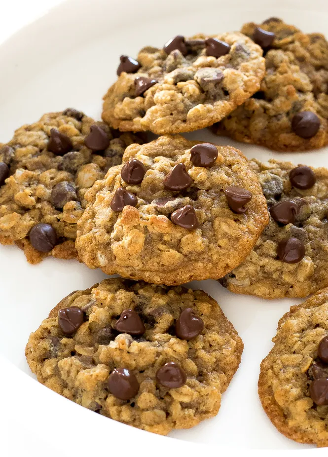

# :cookie: Oatmeal Chocolate Chip Cookies

{ loading=lazy }

| :timer_clock: Total Time |
|:-----------------------: |
| 10 minutes |

## :salt: Ingredients

- :butter: 1 cup (226 g) unsalted butter
- 1.25 cup packed [brown sugar][1]
- :candy: 0.5 cup (99 g) granulated sugar
- :egg: 2 eggs
- :glass_of_milk: 2 Tbsp (28 g) milk
- :flower_playing_cards: 2 tsp vanilla
- :bread: 1.75 cups (161 g) flour
- :chestnut: 1 tsp baking soda
- :ear_of_rice: 2.5 cup (282 g) rolled oats
- :chocolate_bar: 2 cups (340 g) (340) chocolate chips

## :pencil: Instructions

### Step 1

Preheat oven to 365°F.

### Step 2

Combine butter, packed brown sugar, granulated sugar, eggs, milk, vanilla, all-purpose flour, baking soda, rolled oats,
and chocolate chips and bake for 8 to 10 minutes.

!!! tip

    For more flavor, toast the oats first! See [Toasted Rolled Oats](../ingredients/toasted-rolled-oats.md) for instructions.

## :link: Source

- Recipe Box

[1]: <../ingredients/brown-sugar.md>
