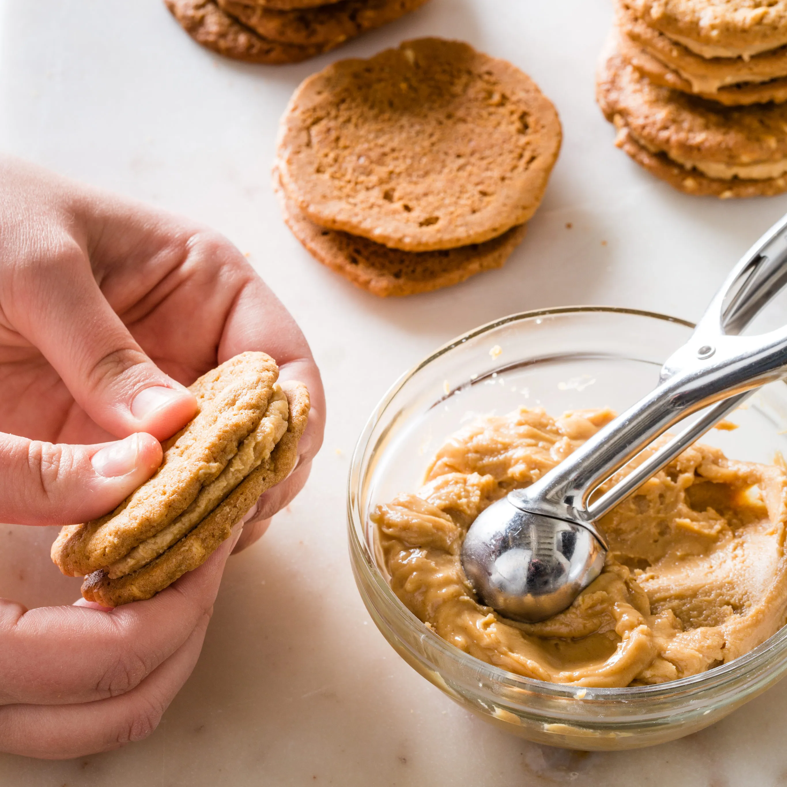

# :peanuts: Peanut Butter Sandwich Cookies

{ loading=lazy }

| :fork_and_knife_with_plate: Serves | :timer_clock: Total Time |
|:----------------------------------:|:-----------------------: |
| 24 | 3.5 hours |

## :salt: Ingredients

=== "Cookies"

    - :chestnut: 1.25 cups (45 g) (6.25 oz/177 g) raw peanuts
    - :baby_bottle: 0.75 cups (117 g) (3.75 oz/106 g) all-purpose flour
    - :chestnut: 1 tsp baking soda
    - :salt: 0.5 tsp salt
    - :butter: 3 Tbsp (42 g) unsalted butter
    - :peanut: 0.5 cup (135 g) [creamy peanut butter][1]
    - :candy: 0.5 cup (99 g) (3.5 oz/99 g) granulated sugar
    - :candy: 0.5 cup (106 g) (3.5 oz/99 g) [light brown sugar][2]
    - :glass_of_milk: 3 Tbsp (43 g) whole milk
    - :egg: 1 large egg

=== "Filling"

    - :peanut: 0.75 cup (202 g) [creamy peanut butter][1]
    - :butter: 3 Tbsp (42 g) unsalted butter
    - :candy: 1 cup (192 g) (4 oz/113 g) confectioners’ sugar

## :cooking: Cookware

- :cookie: 1 baking sheets
- :gear: 1 food processor
- 2 bowls
- :spoon: 1 rubber spatula
- 1 number 60 scoop or tablespoon measure
- :cookie: 1 prepared baking sheet
- :wastebasket: 1 wire rack

## :pencil: Instructions - Cookies

!!! note

    Do not use unsalted peanut butter for this recipe.

### Step 1

Adjust oven racks to upper-middle and lower-middle positions and heat oven to 350°F. Line 2 baking
sheets with parchment paper. Pulse raw peanuts in food processor until finely chopped, about 8 pulses. Whisk all-purpose
flour, baking soda, and salt together in bowl. Whisk 3 Tbsp of unsalted butter, 1/2 cup of creamy peanut butter,
granulated sugar, light brown sugar, whole milk, and egg together in second bowl. Stir flour mixture into peanut butter
mixture with rubber spatula until combined. Stir in peanuts until evenly distributed.

### Step 2

Using number 60 scoop or tablespoon measure (20 g), place 12 mounds, evenly spaced, on each prepared baking sheet.
Using damp hand, flatten mounds until 2 inches in diameter.

### Step 3

Bake until deep golden brown and firm to touch, 13 to 18 minutes, switching and rotating sheets halfway through baking.
Let cookies cool on sheets for 5 minutes. Transfer cookies to wire rack and let cool completely, about 30 minutes.
Repeat portioning and baking remaining dough.

## :pencil: Instructions - Cookies - Filling

### Step 4

Microwave 3/4 cup creamy peanut butter and 3 Tbsp of unsalted butter until butter is melted and warm,
about 40 seconds. Using rubber spatula, stir in confectioners’ sugar until combined.

## :pencil: Instructions - Assembly

### Step 5

Place 24 cookies upside down on work surface. Place 1 level tablespoon (20 g) (or number 60 scoop) warm
filling in center of each cookie. Place second cookie on top of filling, right side up, pressing gently until filling
spreads to edges. Allow filling to set for 1 hour before serving. Assembled cookies can be stored in airtight container
for up to 3 days.

## :link: Source

- <https://www.cooksillustrated.com/recipes/6908-peanut-butter-sandwich-cookies>

[1]: <../ingredients/peanut-butter.md>
[2]: <../ingredients/brown-sugar.md>
