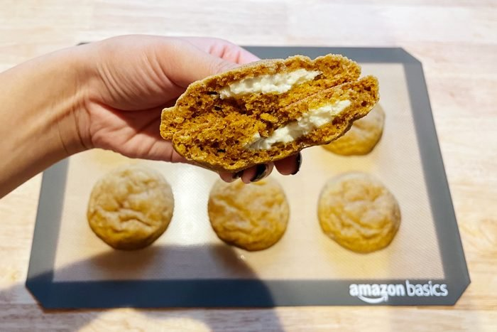

# :jack_o_lantern: Pumpkin Cheesecake Cookies

{ loading=lazy }

| :timer_clock: Total Time |
|:-----------------------: |
| 26 minutes |

## :salt: Ingredients

- :cheese_wedge: 6 oz cold cream cheese
- :candy: 3 Tbsp sugar
- :icecream: 0.5 tsp vanilla
- :candy: 0.25 cup sugar
- :herb: 0.5 tsp pumpkin pie spice
- :jack_o_lantern: 0.5 cup pumpkin purée
- :ear_of_rice: 1.75 cups all-purpose flour
- :herb: 1 Tbsp pumpkin pie spice
- :dash: 0.5 tsp baking powder
- :cup_with_straw: 0.5 tsp baking soda
- :salt: 0.5 tsp salt
- :butter: 0.75 cup unsalted butter
- :maple_leaf: 1 cup light brown sugar
- :egg: 2 egg yolks
- :icecream: 2 tsp vanilla

## :cooking: Cookware

- 1 baking sheet
- 1 bowl
- 1 electric mixer
- 1 small bowl
- 1 plate
- 1 paper towels
- 1 large mixing bowl
- 1 wire rack

## :pencil: Instructions

### Step 1

Line a baking sheet with {}parchment paper or a nonstick baking mat{}. (This reusable silicone baking mat is our
editors’ go-to.)  Combine the cold cream cheese, sugar and vanilla in a bowl. Mix on medium-high speed with an
electric mixer until fluffy. Scoop the filling into 16 2 teaspoon sized portions. Transfer the baking sheet to the
freezer. Leave the cheesecake balls in the freezer until frozen and very firm.

### Step 2

Whisk the sugar and pumpkin pie spice together in a small bowl. Set aside.

### Step 3

Spread the pumpkin purée on a plate. Place paper towels on top and lightly press down to absorb the liquid in the
pumpkin. Repeat this step four times to reduce the pumpkin down from 1/2 cup to about 1/4 cup, removing the extra
liquid. This will ensure the cookies bake properly without being cakey.

### Step 4

Preheat the oven to 350°F. Line two baking sheets with parchment paper. Whisk together the all-purpose flour, pumpkin
pie spice, baking powder, baking soda and salt. Set aside.

### Step 5

In a large mixing bowl, cream the unsalted butter and light brown sugar with an electric mixer on high speed until
fluffy, about 2 minutes. Mix in the egg yolks and vanilla extract until pale and fluffy, about 1 minute. Mix in the
pumpkin.

### Step 6

Mix in the dry ingredients mixture on low speed until combined.

### Step 7

Using a 2 tablespoon sized cookie scoop, portion and roll the dough into 16 balls. Slightly flatten each ball and place
a frozen cheesecake ball in the center. Close the cheesecake ball within the cookie dough, making sure it’s completely
covered. Roll it into a ball again. Only remove the cheesecake balls from the freezer once they’re ready to be used
for each batch of cookies. Roll each filled ball of cookie dough in pumpkin spice sugar.

### Step 8

Place each prepared cookie dough ball on the lined baking sheet. Bake 6 cookies at a time for 12 to 13 minutes. Once
baked, remove the cookies from the oven and let them cool for 10 minutes on the cookie sheet before transferring them to
a wire rack to finish cooling completely.

### Step 9

Note: Properly creaming the butter and sugar is a crucial step to making great cookies with the perfect texture. Don’t
just mix until combined. Mix the butter and sugar for at least two minutes until it’s pale and fluffy for the best
results.

### Step 10

Note: Typically, pumpkin cookies come out very fluffy and cakey due to the moisture content of the pumpkin puree. The
key to making these chewy pumpkin cookies is to reduce the amount of liquid in the pumpkin by patting it with paper
towels.

### Step 11

Note: The cheesecake balls used to fill the cookies should be made before the cookie dough. Place them on a baking sheet
and leave them in the freezer until frozen and firm. This is a crucial step to make sure the cheesecake filling
doesn’t leak out of the cookies while baking.

## :link: Source

- <https://www.tasteofhome.com/article/pumpkin-cheesecake-cookies-recipe/>
