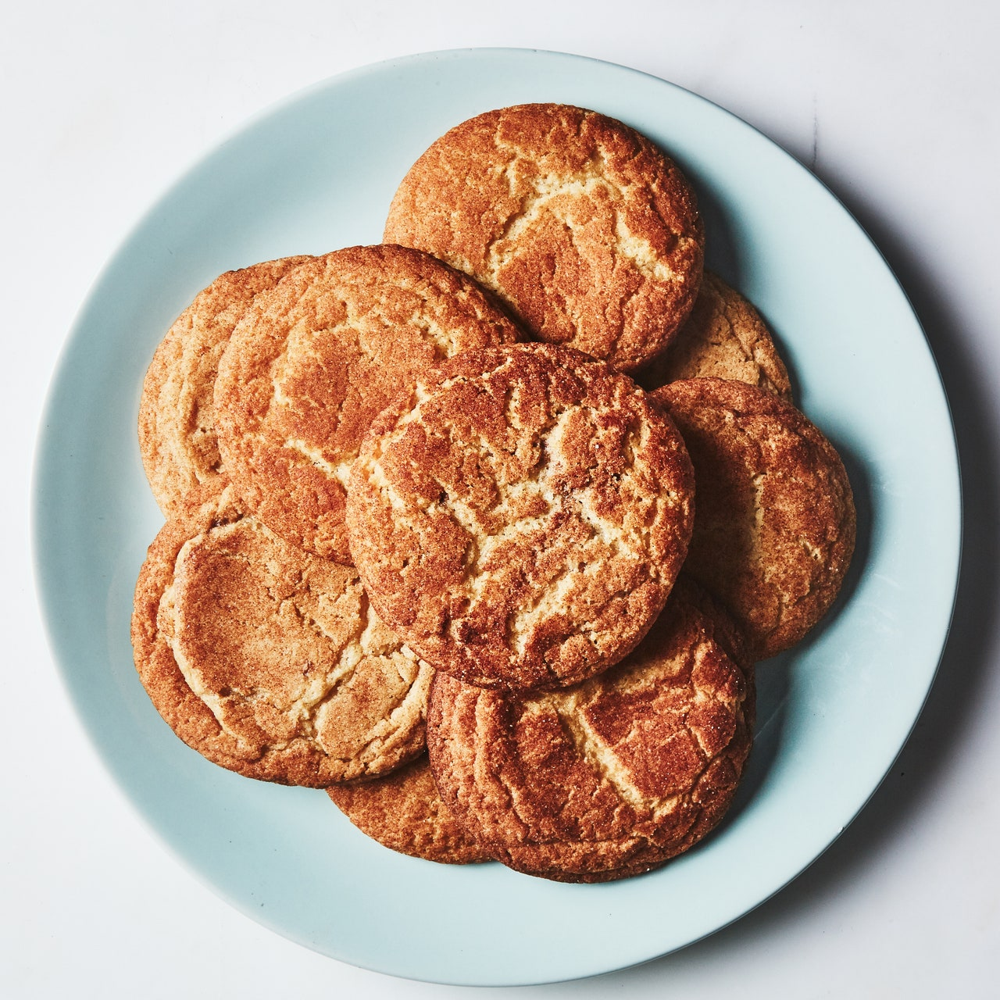

# :cookie: Snickerdoodles

{ loading=lazy }

| :timer_clock: Total Time |
|:-----------------------: |
| 3.04 days |

## :salt: Ingredients

- :butter: 1 cup (226 g) unsalted butter
- :ear_of_rice: 2.5 cups (300 g) all-purpose flour
- :rice: 2 tsp cream of tartar
- :cup_with_straw: 1 tsp baking soda
- :salt: 0.75 tsp salt
- :maple_leaf: 0.5 cup (107 g) light brown sugar
- :candy: 1 cup (198 g) granulated sugar
- :icecream: 1 vanilla bean
- :egg: 2 large eggs
- :custard: 1 Tbsp cinnamon
- :candy: 2 Tbsp (25 g) granulated sugar

## :cooking: Cookware

- 1 medium bowl
- 1 electric mixer
- 1 large bowl
- 1 rimmed baking sheet
- 1 parchment paper
- 1 medium bowl

## :pencil: Instructions

### Step 1

Melt and cool the unsalted butter slightly.

### Step 2

Whisk all-purpose flour, cream of tartar, baking soda, and salt in a medium bowl. Using an electric mixer on medium
speed, beat unsalted butter, light brown sugar, and 1 cup granulated sugar in a large bowl, scraping down sides, until
incorporated. Scrape in seeds from vanilla bean; reserve pod for another use.

### Step 3

Add eggs and continue to beat until mixture is pale yellow, begins to thicken, and falls from beaters in a ribbon-like
stream, about 3 minutes. Reduce mixer speed to low. Gradually add dry ingredients and continue to beat, scraping down
sides and bottom of bowl, until just combined. Let sit at room temperature at least 30 minutes to hydrate flour; dough
will be very loose but will thicken as it sits.

### Step 4

Arrange a rack in center of oven; preheat to 400°F. Line a rimmed baking sheet with parchment paper. Whisk cinnamon and
remaining 2 Tbsp granulated sugar in a medium bowl.

### Step 5

Using a 1 oz (30 g) ice cream scoop ([scoop number 40][1]) or a generous, heaping tablespoonful, portion cookies and
roll into small balls with your hands. Toss in cinnamon-sugar until coated all over. Transfer to prepared sheet,
spacing about 3" apart. Do not flatten; cookies will spread as they bake.

### Step 6

Bake cookies until edges are lightly browned and firm but centers are puffed and soft, 8 to 10 minutes. Let cool on
sheets 10 minutes, then transfer to a wire rack and let cool completely.

!!! note "Do Ahead"

    Do Ahead: Cookie dough can be made 3 days ahead; cover and chill. Let dough come to room temperature before
    portioning and coating in cinnamon-sugar.

## :link: Sources

- <https://www.bonappetit.com/recipe/best-snickerdoodles>
- <https://www.thekitchn.com/snickerdoodle-recipe-reviews-22969541>

[1]: <../reference/measuring.md#cookie-scoop-conversion-chart>
