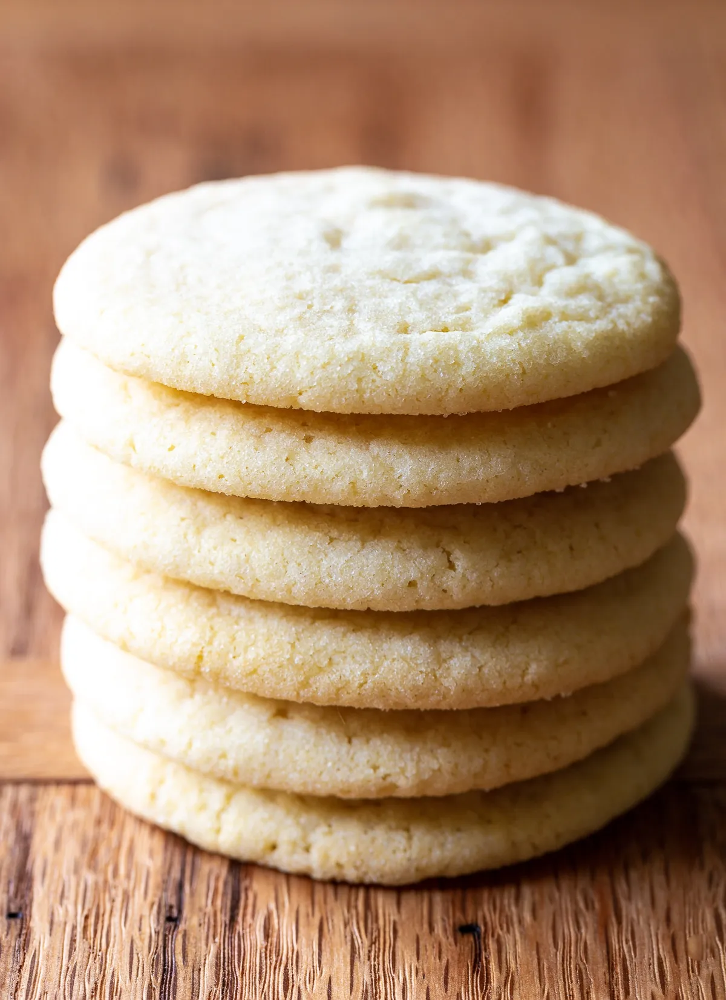

# :cookie: Tante Myrn's Sugar Cookies

{ loading=lazy }

| :fork_and_knife_with_plate: Serves | :timer_clock: Total Time |
|:----------------------------------:|:-----------------------: |
| 4 dozen | 60 minutes |

## :salt: Ingredients

- :butter: 1 cup butter
- :candy: 1 cup (113 g) confectioners' sugar
- :candy: 1 cup (198 g) granulated sugar
- :egg: 2 eggs
- :olive: 1 cup (198 g) vegetable oil
- :flower_playing_cards: 2 tsp vanilla
- :chestnut: 1 tsp baking soda
- :glass_of_milk: 1 tsp (6 g) cream of tartar
- :salt: 0.5 tsp salt
- :bread: 5 cups (460 g) flour

## :cooking: Cookware

- :bowl_with_spoon: 1 medium bowl
- :cookie: 1 baking sheet

## :pencil: Instructions

### Step 1

Preheat oven to 350°F.

### Step 2

In medium bowl, cream butter with confectioners' sugar and 1 cup granulated sugar. Beat in eggs until smooth. Slowly
stir in vegetable oil, vanilla, baking soda, cream of tartar, salt, and flour.

### Step 3

Chill for easy handling. Shape into walnut size balls. Dip in sugar. Place on baking sheet and press down. Bake for 10
to 12 minutes.

## :link: Source

- Tante Myrna Seccia
