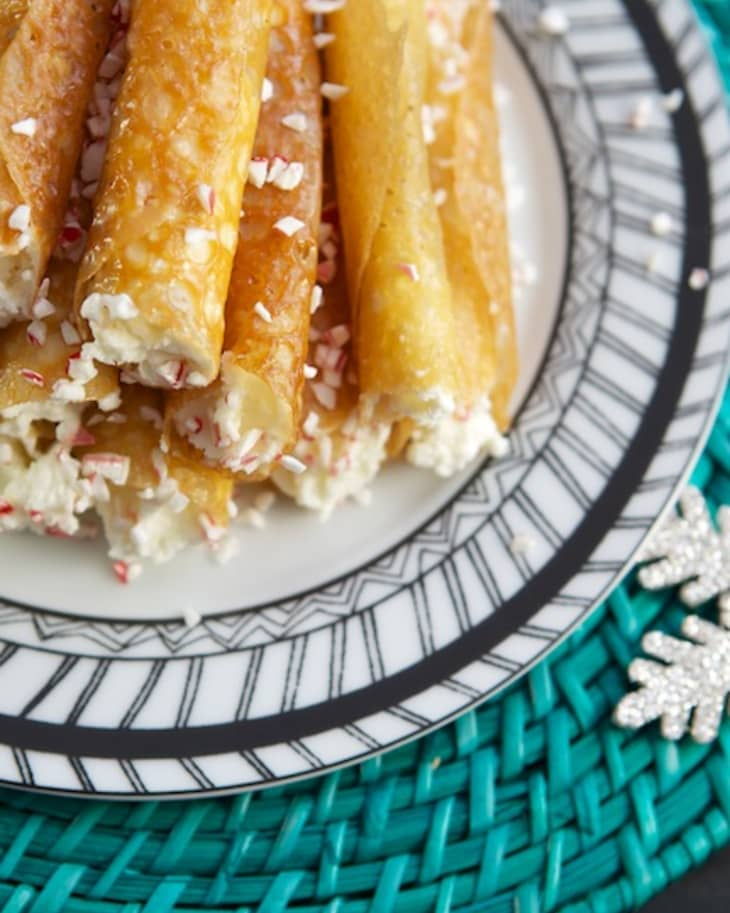

# :cake: Brandy Snaps

{ loading=lazy }

| :fork_and_knife_with_plate: Serves | :timer_clock: Total Time |
|:----------------------------------:|:-----------------------: |
| 36 | 7 minutes |

## :salt: Ingredients - Cookies

- :corn: 0.33 cup dark corn syrup
- :butter: 0.25 lb unsalted butter, cut into pieces
- :candy: 0.5 cup granulated sugar
- :ear_of_rice: 0.5 cup all-purpose flour

## :salt: Ingredients - Whipped Cream

- :icecream: 1 cup heavy cream
- :candy: 0.25 cup confectioners' sugar
- :tumbler_glass: 1 Tbsp brandy
- :salt: 0.125 tsp salt
- :icecream: 0.5 tsp vanilla

## :cooking: Cookware

- 1 baking sheets
- 1 electric mixer

## :pencil: Instructions - Cookies

### Step 1

Put dark corn syrup, unsalted butter, cut into pieces and granulated sugar into heavy-bottomed pan. Heat mixture over
low heat, stirring, until butter has melted and mixture is smooth. Don’t let mixture boil. Remove from heat and
vigorously stir in all-purpose flour, beating until smooth. (Rotary beater will do this easily.)

### Step 2

Drop batter by 1/2 teaspoons on greased baking sheets. Try doing only 5 cookies at a time, until you see how much they
spread. Bake at 350°F until cookies turn nice medium caramel color, about 5 to 7 minutes. Cookies should spread into
about 2.5 inch rounds, or little larger, and bubble.

### Step 3

Remove from oven and cool until cookies are firm enough to lift off baking sheet with spatula. Roll with fingers or
around clean broom handle into tubes about 3/4 inch around.

### Step 4

If cookies get too firm to manage, return to oven 1 to 2 minutes to soften. If batter in pan gets too stiff to use,
heat, stirring, until melted enough to drop from teaspoon.

## :pencil: Instructions - Whipped Cream

### Step 5

To make the brandy whipped cream, add the heavy cream, salt, vanilla, and confectioners' sugar to the bowl of an
electric mixer fitted with a whisk attachment and whip until it forms soft peaks. Add the brandy and mix in.

### Step 6

Pipe the brandy whipped cream into the rolled cookies.

## :link: Sources

- <https://www.latimes.com/archives/la-xpm-1996-01-11-fo-23229-story.html>
- <https://www.thekitchn.com/marion-cunninghams-brandy-snaps-recipe-review-from-the-kitchn-181552>
- <https://www.foodnetwork.com/recipes/ree-drummond/brandy-whipped-cream-2258854>
