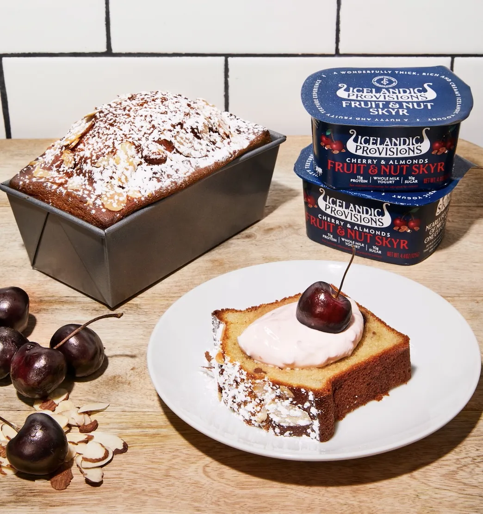

# :cake: Cherry Almond Skyr Cake

{ loading=lazy }

| :timer_clock: Total Time |
|:-----------------------: |
| 45 minutes |

## :salt: Ingredients

- :ramen: 2 4.4-oz pkgs Icelandic Provisions Fruit & Nut Cherry & Almonds Skyr
- :candy: 150 g granulated sugar
- :olive: 64 g grapeseed oil
- :egg: 3 eggs
- :flower_playing_cards: 1 tsp vanilla
- :salt: 1 tsp salt
- :bread: 250 g all-purpose flour
- :chestnut: 0.5 tsp baking soda
- :apple: 20 amarena cherries or fresh pitted black cherries
- :chestnut: 0.5 cup (43 g) sliced almonds

## :cooking: Cookware

- 1 mixing bowl
- 1 spatula
- 1 loaf pans
- 1 paring knife / cake tester

## :pencil: Instructions

### Step 1

Preheat oven to 320°F (convection) or 360°F (conventional).

### Step 2

In a mixing bowl, combine the Icelandic Provisions Fruit & Nut Cherry & Almonds Skyr, granulated sugar, grapeseed oil,
eggs, vanilla extract, and salt with a spatula. Mix until smooth.

### Step 3

Add the all-purpose flour and baking soda, stirring until just combined. Be careful not to over mix.

### Step 4

Butter your loaf pans. Fill both pans halfway up with batter. Divide amarena cherries or fresh pitted black cherries and
scatter the cherries on top of the batter in both pans. Top off with remaining batter until each pan is 3/4 full (do not
fill to the top, as the cakes will rise in the oven). Sprinkle the tops with a handful of sliced almonds.

### Step 5

Bake for 30 to 35 minutes, or until a paring knife / cake tester comes out clean and the surface is golden. Let cool for
5 to 10 minutes before unmolding. Slice and enjoy!

### Step 6

Best enjoyed fresh-baked day of. You can also store in an air-tight container and enjoy next day.

## :link: Source

- <https://www.icelandicprovisions.com/skyr-recipes/cherry-almond-skyr-cake/>
