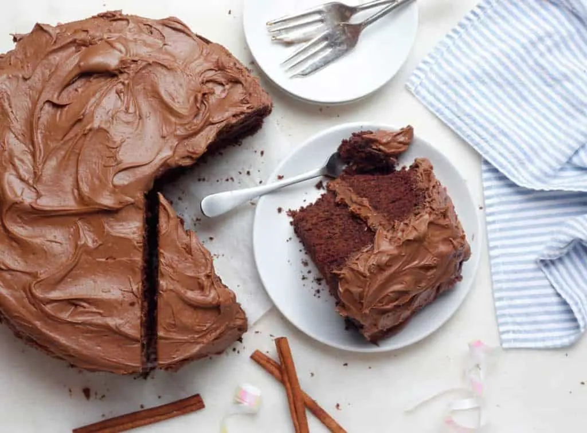

# :cake: Cinnamon Chocolate Cake

{ loading=lazy }

| :fork_and_knife_with_plate: Serves | :timer_clock: Total Time |
|:----------------------------------:|:-----------------------: |
| 24 | 20 minutes |

## :salt: Ingredients

=== "Cake"

    - :bread: 2 cups (240 g) all-purpose flour
    - :candy: 2 cups (396 g) granulated sugar
    - :chestnut: 1 tsp (4 g) cinnamon
    - :glass_of_milk: 1 stick margarine or butter
    - :chocolate_bar: 4 tsp (9 g) cocoa powder
    - :droplet: 1 cup (227 g) water
    - :butter: 0.5 cup (92 g) vegetable shortening
    - :icecream: 0.5 cup [buttermilk](../../ingredients/buttermilk.md)
    - :chestnut: 1 tsp baking soda
    - :egg: 2 eggs
    - :flower_playing_cards: 2 tsp vanilla

=== "Icing"

    - 1 stick margarine
    - :chocolate_bar: 2 Tbsp (14 g) cocoa powder
    - :glass_of_milk: 6 Tbsp (85 g) milk
    - :candy: 1 lb confectioners' sugar
    - :flower_playing_cards: 1 tsp vanilla
    - :chestnut: 1 tsp (4 g) cinnamon
    - :chestnut: 1 cup (128 g) chopped walnuts
    - :coconut: 1 cup (226 g) coconut

## :cooking: Cookware

- 1 mixing bowl
- 1 saucepan
- 1 11" x 15" x 3" jellyroll pan

## :pencil: Instructions

### Step 1

Preheat oven to 400°F.

### Step 2

In mixing bowl, combine all-purpose flour, granulated sugar, and cinnamon; set aside.

### Step 3

In saucepan, heat margarine or butter, cocoa powder, water, and vegetable shortening to boiling: pour over dry
ingredients.

### Step 4

Add [buttermilk](../../ingredients/buttermilk.md), baking soda, eggs, and vanilla; mix well.

### Step 5

Pour into an 11" x 15" x 3" jellyroll pan and bake 20 minutes.

### Step 6

In a saucepan, combine margarine, cocoa powder, and milk; heat to boiling.

### Step 7

Remove from heat; add confectioners' sugar a little at a time, stirring thoroughly. Add vanilla, cinnamon, chopped
walnuts, and coconut.

### Step 8

Spread over cake while still warm. "Tastes wonderful!"

## :link: Source

- Olga Sarouhan, Edison High School, Huntington Beach, CA: Sweet Surprises: Compiled By Professional Home Economics
  Teachers of California, Nevada, and Arizona, ©1998 California Cookbook Company
