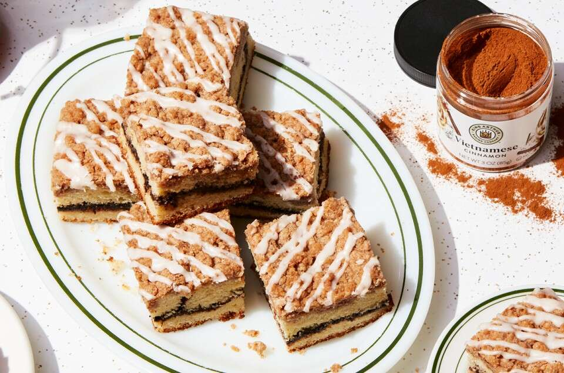

# :cake: Cinnamon-Crisp Coffee Cake

| :fork_and_knife_with_plate: Serves | :timer_clock: Total Time |
|:----------------------------------:|:-----------------------: |
| 8" square cake | 2 minutes |

## :salt: Ingredients - Filling

- 66 g granulated sugar
- 1 Tbsp cinnamon
- 2 Tbsp unsweetened cocoa

## :salt: Ingredients - Crumbs

- 120 g all-purpose flour
- 75 g granulated sugar
- 14 g confectioners' sugar
- 1 Tbsp cinnamon
- 0.25 tsp salt
- 85 g unsalted butter
- 1 tsp vanilla

## :salt: Ingredients - Cake

- 240 g all-purpose flour
- 149 g granulated sugar
- 1 tsp baking powder
- 0.75 tsp salt
- 0.25 tsp baking soda
- 113 g unsalted butter
- 2 tsp vanilla
- 2 large eggs
- 227 g buttermilk
- 227 g Greek yogurt (alternative)

## :salt: Ingredients - Glaze (Optional)

- 85 g confectioners' sugar
- 1 pinch cinnamon
- 3 tsp water

## :cooking: Cookware

- 1 8" square pan
- 1 parchment sling or reusable silicone liner
- 1 small bowl
- 1 medium bowl
- 1 large bowl
- 1 small offset spatula
- 1 small bowl

## :pencil: Instructions

### Step 1

Preheat the oven to 350°F. Prepare an 8" square pan with a parchment sling or reusable silicone liner, then lightly
grease the sides of the pan. Alternatively, line a 9" cake pan with a round piece of parchment or round reusable liner
and lightly grease the sides.

## :pencil: Instructions - Filling

### Step 2

In a small bowl, combine the granulated sugar, cinnamon, and unsweetened cocoa. Set aside.

## :pencil: Instructions - Crumbs

### Step 3

Weigh your all-purpose flour; or measure it by gently spooning it into a cup, then sweeping off any excess. In a medium
bowl, whisk together the flour, granulated sugar, confectioners' sugar, cinnamon, and salt. Add the cubed, room
temperature unsalted butter and vanilla; toss to combine. Using a bowl scraper, fork, or your fingers, work in the
butter until crumbs form and no dry spots remain. The crumbs should be irregular, ranging in size from a pea to walnut.
Set aside.

## :pencil: Instructions - Cake

### Step 4

In a large bowl or bowl of a stand mixer, combine the all-purpose flour, granulated sugar, baking powder, salt, and
baking soda. Add the unsalted butter and mix at low speed using an electric hand mixer or the flat beater attachment of
a stand mixer until the mixture looks sandy, about 1 to 2 minutes. (This mixing method is called reverse creaming and
is also known as the paste method.)

### Step 5

Beat in the vanilla and eggs, then mix until no dry spots of flour remain. Stop the mixer and scrape the bowl and beater
attachment as needed; the mixture will be thick.

### Step 6

If using buttermilk, slowly pour it into the mixture while the mixer is running on low speed. If using Greek yogurt
(alternative), add the yogurt all at once before starting to mix. Continue to stir until the batter is smooth. Stop to
scrape the bowl and then mix again at low speed for 30 seconds.

## :pencil: Instructions - Assembly

### Step 7

Transfer half the batter (about 1 1/2 cups, 420 g) into the prepared pan, spreading it all the way to the edges. (A
small offset spatula is a helpful tool here.)

### Step 8

Sprinkle the filling evenly across the batter.

### Step 9

Transfer the remaining batter atop the filling and gently spread to the edges. (The batter will be pourable if you’ve
used buttermilk; otherwise, transfer the thick batter by dolloping portions over the filling then use a spatula to
smooth it out into an even layer.) It’s OK if a little bit of the filling gets mixed into the top layer of batter.

### Step 10

Sprinkle the crumbs evenly over the batter and gently press to adhere.

### Step 11

Bake the cake for about 45 to 50 minutes, until it's set in the middle and light brown. When the cake is done, a
toothpick or paring knife inserted into the center should come out mostly clean.

### Step 12

Remove the cake from the oven and allow it to cool in the pan for 20 minutes. Prepare the glaze while the coffee cake is
cooling, if using.

## :pencil: Instructions - Glaze (Optional)

### Step 13

In a small bowl, stir together the confectioners' sugar, cinnamon, and 2 to 3 tsp of water until smooth, starting with
smaller amount of water. Add additional water as needed until the glaze is the consistency of molasses.

### Step 14

Remove the cake from the pan using the overhanging edges of parchment as handles to gently lift it out. Place the cake
(still on the parchment) on a wire rack to cool slightly.

### Step 16

Drizzle the glaze over the cake, or finish by dusting with non-melting sugar or confectioners’ sugar.

## Sources

- <https://www.kingarthurbaking.com/recipes/cinnamon-crisp-coffee-cake-recipe>
- <https://www.youtube.com/watch?v=RXBlS39oTTg>
