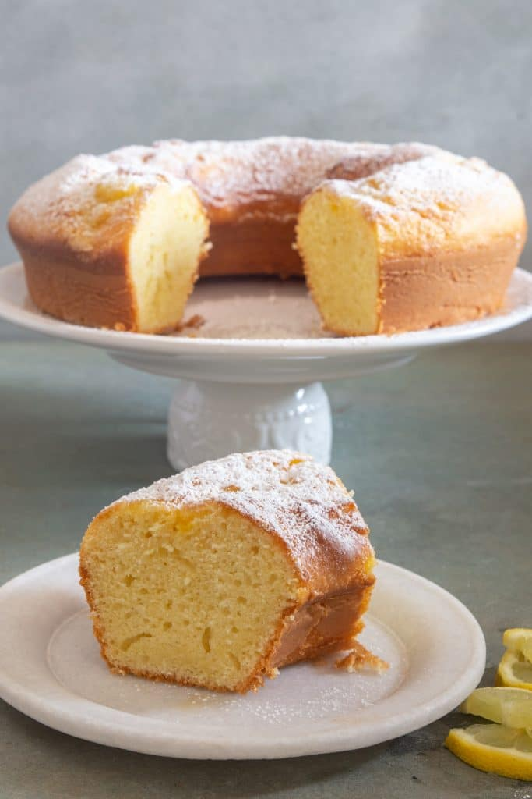

# :egg: Egg Yolk Lemon Cake

{ loading=lazy }

| :fork_and_knife_with_plate: Serves | :timer_clock: Total Time |
|:----------------------------------:|:-----------------------: |
| 10 | 37 minutes |

## :salt: Ingredients

- :ear_of_rice: 260 g all-purpose flour
- :dash: 1.75 tsp baking powder
- :salt: 0.25 tsp salt
- :egg: 3 large egg yolks
- :candy: 130 g granulated sugar
- :glass_of_milk: 275 g milk
- :oil_drum: 50 g vegetable oil
- :lemon: 1 lemon zest
- :lemon: 1 Tbsp lemon juice
- :candy: some confectioners' sugar

## :cooking: Cookware

- 1 9 inch cake pan or 9-10 inch bundt pan
- 1 medium bowl
- 1 mixing bowl

## :pencil: Instructions

### Step 1

Preheat oven to 350°F (180°C). Grease and flour a 9 inch cake pan or 9-10 inch bundt pan.

### Step 2

In a medium bowl whisk together the all-purpose flour, baking powder and salt. Set aside.

### Step 3

In the mixing bowl beat the egg yolks and granulated sugar until light and fluffy, approximately 5 minutes. Add the
milk, vegetable oil, lemon zest and lemon juice beat to combine.

### Step 4

Beat in the flour a little at a time, beating between each addition. Beat until smooth, 1 to 2 minutes. Transfer to the
prepared pan and bake for approximately 30 minutes. Test for doneness with a toothpick. Let cool in the pan then move to
a plate. Dust with confectioners' sugar before serving. Enjoy!

## :link: Source

- <https://anitalianinmykitchen.com/egg-yolk-lemon-cake>
