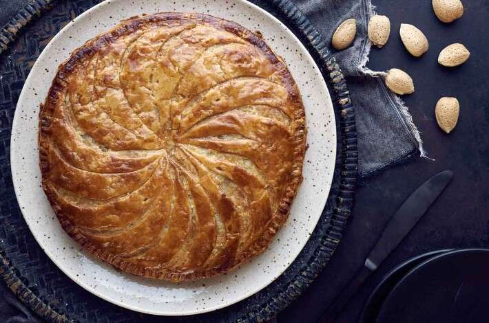

# :cake: Galette des Rois

{ loading=lazy }

| :fork_and_knife_with_plate: Serves | :timer_clock: Total Time |
|:----------------------------------:|:-----------------------: |
| 8 | 1 hour |

## :salt: Ingredients

- :butter: 100 g unsalted butter, softened
- :candy: 100 g granulated sugar
- :egg: 1 large egg
- :chestnut: 100 g [almond flour][1]
- :flower_playing_cards: 1 tsp vanilla extract
- :flower_playing_cards: 1/2 tsp almond extract
- :salt: 1 pinch salt
- :bread: 2 sheets (approx. 450 g) puff pastry
- :egg: 1 egg (for egg wash)
- :droplet: 1 Tbsp water (for egg wash)
- :chestnut: 1 fève (whole almond, bean, or small ceramic figure)

## :cooking: Cookware

- 1 medium bowl
- 1 baking sheet
- 1 parchment paper
- 1 pastry brush
- 1 small knife

## :pencil: Instructions

### Step 1

Preheat the oven to 400°F (200°C) and line a baking sheet with parchment paper.

### Step 2

In a medium bowl, cream together the softened butter and sugar until light and fluffy.

### Step 3

Beat in the egg, [almond flour][1], vanilla extract, almond extract, and salt until smooth. This is your frangipane.

### Step 4

Place one sheet of puff pastry on the prepared baking sheet. If it's a square, you can cut it into a large circle.

### Step 5

Spread the frangipane in the center of the pastry, leaving a 1-inch border around the edge.

### Step 6

Hide the fève in the frangipane.

### Step 7

Whisk together the remaining egg and water to make an egg wash. Brush the border of the pastry with the egg wash.

### Step 8

Place the second sheet of puff pastry over the filling and press the edges firmly to seal. You can use a fork to crimp the
edges or use a small knife to create a decorative pattern.

### Step 9

Brush the top of the galette with the remaining egg wash. Use a small knife to score a pattern into the top of the pastry,
being careful not to cut all the way through.

### Step 10

Bake for 25 to 30 minutes, or until the galette is golden brown and puffed.

### Step 11

Allow to cool slightly before serving. The person who finds the fève is crowned king or queen for the day!

## :link: Source

- <https://www.davidlebovitz.com/galette-des-rois-kings-cake-recipe/>

[1]: <../../ingredients/almond-flour.md>
