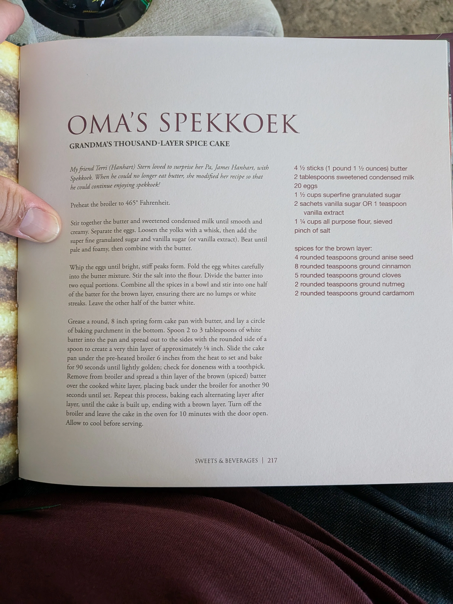

# :cake: Oma's Spekkoek

{ loading=lazy }

| :fork_and_knife_with_plate: Serves | :timer_clock: Total Time |
|:----------------------------------:|:-----------------------: |
| 12 | 1 hour 30 minutes |

## :salt: Ingredients

- :butter: 4 sticks butter (1 pound)
- :glass_of_milk: 2 Tbsp sweetened condensed milk
- :egg: 20 eggs
- :candy: 1.5 cups superfine granulated sugar
- :candy: 2 sachets vanilla sugar (or 1 tsp vanilla extract)
- :ear_of_rice: 1.5 cups all purpose flour, sieved
- :salt: 1 pinch salt

### Spices for the brown layer

- :seedling: 4 rounded tsp ground anise seed
- :seedling: 8 rounded tsp ground cinnamon
- :seedling: 5 rounded tsp ground cloves
- :seedling: 2 rounded tsp ground nutmeg
- :seedling: 2 rounded tsp ground cardamom

## :cooking: Cookware

- bowl
- 8 inch springform pan
- spoon

## :pencil: Instructions

### Step 1

Preheat the broiler to 465° Fahrenheit.

### Step 2

Stir together the **butter** and **sweetened condensed milk** until smooth and creamy.

### Step 3

Separate the **eggs**. Loosen the yolks with a whisk, then add the **superfine granulated sugar** and **vanilla sugar** (or vanilla extract). Beat until pale and foamy, then combine with the butter mixture.

### Step 4

Whip the egg whites until bright, stiff peaks form. Fold the egg whites carefully into the butter mixture.

### Step 5

Stir the **salt** into the sieved **all purpose flour**. Fold this into the batter.

### Step 6

Divide the batter into two equal portions.

### Step 7

Combine all the spices (**ground anise seed**, **ground cinnamon**, **ground cloves**, **ground nutmeg**, and **ground cardamom**) in a bowl and stir into one half of the batter for the brown layer, ensuring there are no lumps or white streaks. Leave the other half of the batter white.

### Step 8

Grease a round, 8 inch springform pan with butter, and lay a circle of baking parchment in the bottom. Spoon 2 to 3 tablespoons of white batter into the pan and spread out to the sides with the rounded side of a spoon to create a very thin layer of approximately 1/8 inch.

### Step 9

Slide the cake pan under the preheated broiler 6 inches from the heat to set and bake for 90 seconds until lightly golden; check for doneness with a toothpick.

### Step 10

Remove from broiler and spread a thin layer of the brown (spiced) batter over the cooked white layer, placing back under the broiler for another 90 seconds until set.

### Step 11

Repeat this process, baking each alternating layer after layer, until the cake is built up, ending with a brown layer. Turn off the broiler and leave the cake in the oven for 10 minutes with the door open. Allow to cool before serving.

## :link: Source

- *Indo Dutch Kitchen Secrets* by Jeff Kesberry ([GitHub Issue #1364](https://github.com/nicholaswilde/recipes/issues/1364))
