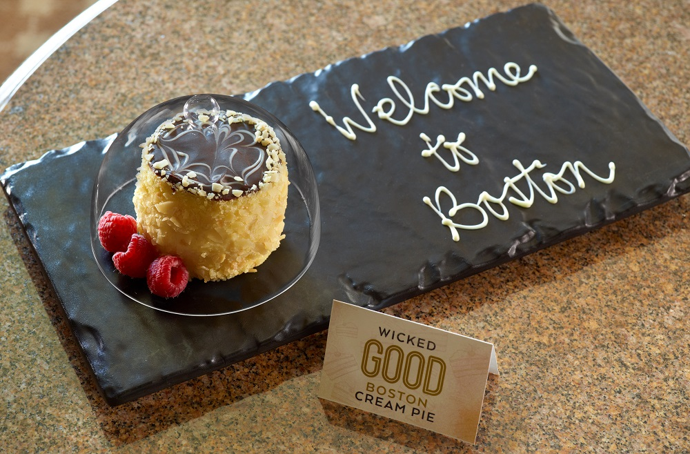

# :cake: The Original Boston Cream Pie

{ loading=lazy }

| :timer_clock: Total Time |
|:-----------------------: |
| 21 minutes |

## :salt: Ingredients - Cake

- :egg: 7 egg
- :candy: 8 oz granulated sugar
- :ear_of_rice: 1 cup all-purpose flour
- :butter: 1 oz melted butter

## :salt: Ingredients - Pastry Cream

- :butter: 1 Tbsp unsalted butter
- :glass_of_milk: 2 cups milk
- :icecream: 2 cups light cream
- :candy: 0.5 cup granulated sugar
- :corn: 3.5 Tbsp cornstarch
- :egg: 6 eggs
- :tumbler_glass: 1 tsp dark rum

## :salt: Ingredients - Icing

- :cake: 6 oz white fondant
- :chocolate_bar: 3 oz semisweet chocolate
- :cake: 5 oz white fondant

## :salt: Ingredients - Chocolate Icing

- :chocolate_bar: 6 oz semisweet chocolate
- :hotsprings: 2 oz warm water

## :salt: Ingredients - White Icing

- :candy: 1 cup confectioners' sugar
- :corn: 1 tsp corn syrup
- :hotsprings: 1 tsp warm water

## :cooking: Cookware

- 1 wooden spatula
- 1 10-inch greased cake pan
- 1 saucepan
- 1 plastic wrap
- 1 slicing knife
- 1 piping bag

## :pencil: Instructions - Cake

### Step 1

Separate egg yolks and whites into two separate bowls. Add 1/2 of the granulated sugar to each bowl. Beat both until
peaked. When stiff, fold the whites into the yolk mixture. Gradually add all-purpose flour, mixing with a wooden
spatula. Mix in the melted butter. Pour this mixture into a 10-inch greased cake pan. Bake at 350°F for about 20
minutes, or until spongy and golden. Remove from the oven and allow to cool fully.

### Step 2

Bring to a boil in a saucepan the unsalted butter, milk and light cream. While this mixture is cooking, combine the
granulated sugar, cornstarch and eggs in a bowl and whip until ribbons form. When the cream, milk, and butter mixture
reaches the boiling point, whisk in the egg mixture and cook to boiling. Boil for 1 minute. Pour into a bowl and cover
the surface with plastic wrap. Chill overnight if possible. When chilled, whisk to smooth out and flavor with 1 tsp dark
rum.

### Step 3

Level the sponge cake off at the top using a slicing knife. Cut the cake into two layers. Spread the flavored pastry
cream over one layer. Top with the second cake layer. Reserve a small amount of the pastry cream to spread on the sides
to adhere to the almonds.

## :pencil: Instructions - Chocolate Fondant

### Step 4

Warm 6 oz. of white fondant over boiling water to approximately 105 degrees. Add melted semisweet chocolate. Thin to a
spreading consistency with water.

## :pencil: Instructions - White Fondant

### Step 5

Warm 5 oz. of white fondant over boiling water to approximately 105 degrees. Thin with water if necessary. Place in a
piping bag with a 1/8-inch tip.

## :pencil: Instructions - Alternate approach to Step 4 & 5

### Step 6

Melt the semisweet chocolate. Combine with warm water. Combine ingredients and warm to approximately 105 degrees.
Adjust the consistency with water. It should flow freely from the pastry bag.

### Step 7

Spread a thin layer of chocolate fondant icing on the top of the cake. Follow immediately with spiral lines starting
from the center of the cake, using the white fondant in the pastry bag. Score the white lines with the point of a paring
knife, starting at the center and pulling outward to the edge. Spread sides of cake with a thin coating of the reserved
pastry cream. Press on toasted almonds for the final step of our classic Boston Cream Pie recipe.

## :link: Source

- <https://www.omnihotels.com/blog/boston-cream-pie-recipe-original/>
